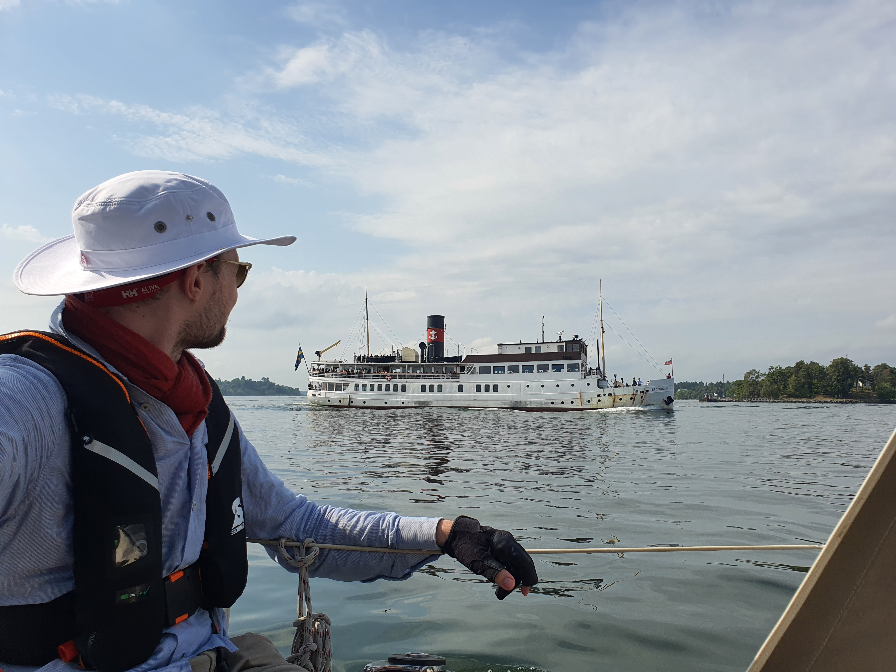

Last groceries before leaving were done early and we left the dock under no wind and a very humid and warm air. As this promises to be the last summer weekend a lot of boat traffic was afoot. The Swedes truly use their waterways actively. While we were motoring on we noticed that the locals like to store their boats out of the water either on ramps or small boat elevators. I think i would also do that as the locals drive very fast and make very big waves while doing that.

 

We found a convenient gas station along the way and filled up our canisters and tank. Now we should be good till we reach Poland and maybe up to Berlin too. Against our hopes, the wind never was higher than 5 knots, so today we did not raise the sails at all. Now some lunch and exploring the Storön!

* Distance today: 15 NM
* Distance total: 1947.7 NM
* Motor hours: 3.2
* Lunch: Miisas cous cous salad
