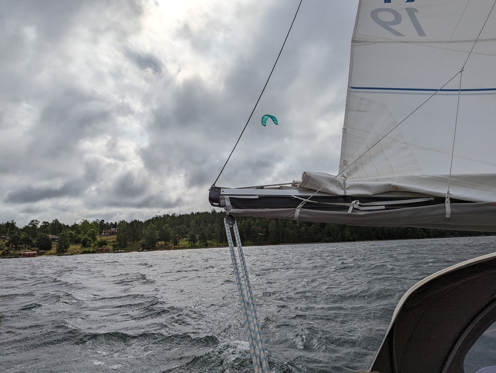
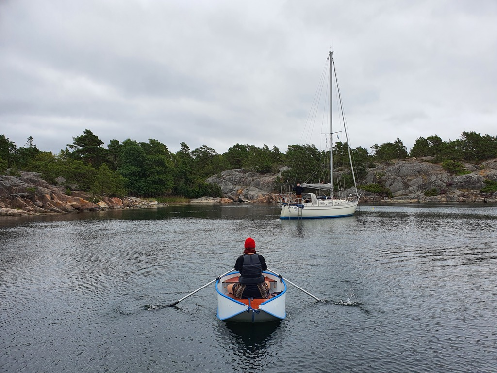

In the morning we had a pretty hasty departure from the nature harbour - the wind had shifted and our neighbor was extremely close to fouling our anchor while hoisting theirs. Despite that, we managed to enjoy proper coffee and breakfast before leaving.

Somewhat high winds were forecasted, and so we left the bay with a first reef. Both the forecast and the experienced wind kept getting higher, and so we later went to second reef. Even with this, we were frequently exceeding hull speed at broad reach.

 

We first checked the Swedish Cruising Club's outer harbour at Runmarö, but it looked to be quite exposed. The one boat on a buoy there was dancing a lot. Our next target was Nämdö. There we dropped sail, and checked the ends of the bay. Not enough protection, especially as the forecast for next 48 hours started to get to full gale readings.

 

In the end we picked the nature harbour at Böteskobben. This is in the outer archipelago, but still quite well protected. To be on the safe side, we anchored with our best bow anchor, and set up shorefasts to control the swaying radius. Now we just sit tight and wait for the weather to improve.

* Distance today: 26.8NM
* Total distance: 1974.5NM
* Lunch: forest mushroom risotto
