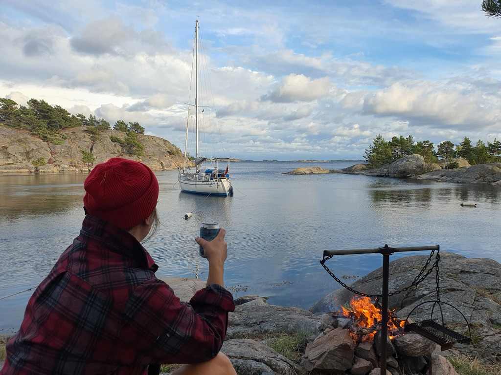
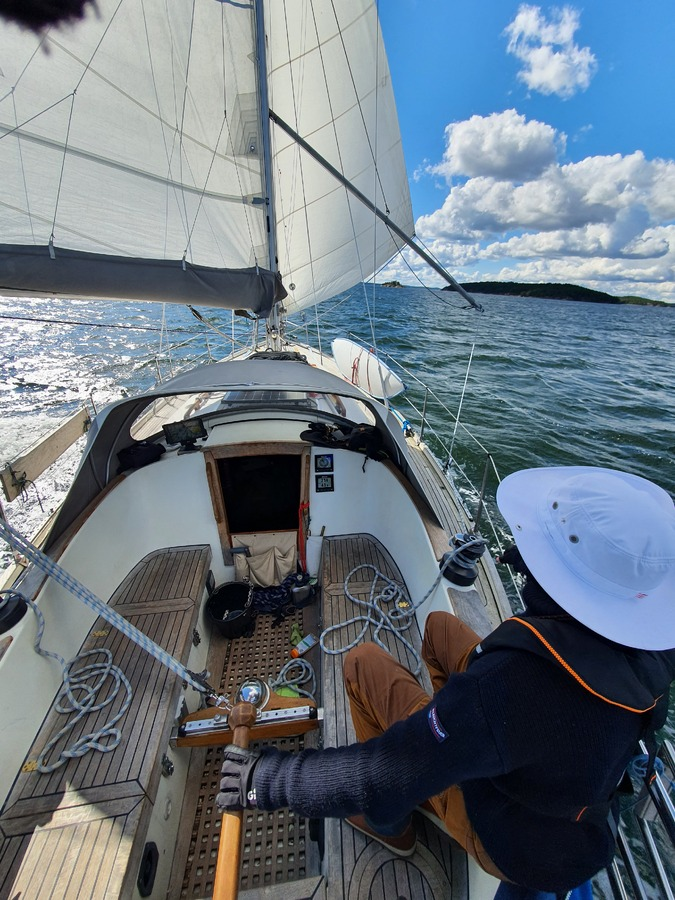

Our storm anchorage worked great - we only received some turbulence from the gales blowing by. Yesterday evening once the rains passed we even managed to have some BBQ.

 

After the morning coffee we removed the shorefasts and hoisted anchor. What a great sailing day! We started on a broad reach with the second reef, and as we arrived to the inner archipelago, we were able to shake it to the first.

 

In the end of the fast passage we docked at the Nynäshamn guest harbour. Some sauna, and charging the batteries badly depleted by the last few cloudy and windy days. The harbour is pretty quiet now that the season is over, but at least all facilities are still open.

* Distance today: 33.1NM
* Total distance: 2007.6NM
* Engine hours: 1.6
* Lunch: potato parmesan bracioles
