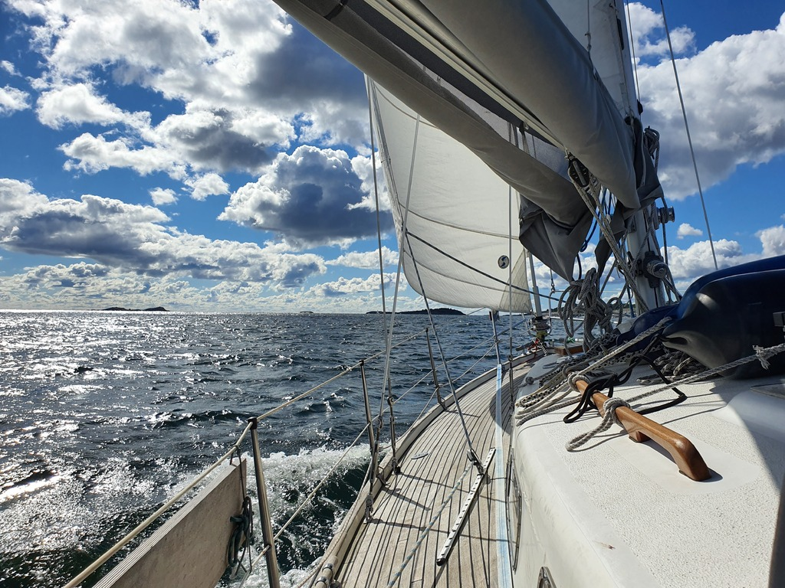

Now we're retracing our route from three months ago. We filled water at Nynäshamn, and then headed out. From Nynäshamn to Landsort it was all on a broad reach, then as we turned west the wind was mostly on the nose.

 

We navigated the narrow Sävö strait, and then the twisty-turny Stendörren. And finally, back to the nice nature harbour at Äspkärsfladan. We claimed the last free SXK buoy, had proper lunch, and then assembled the banana boat for an adventure on land.

 

* Distance today: 25NM
* Total distance: 2032.6NM
* Lunch: spaghetti with avocado sauce
