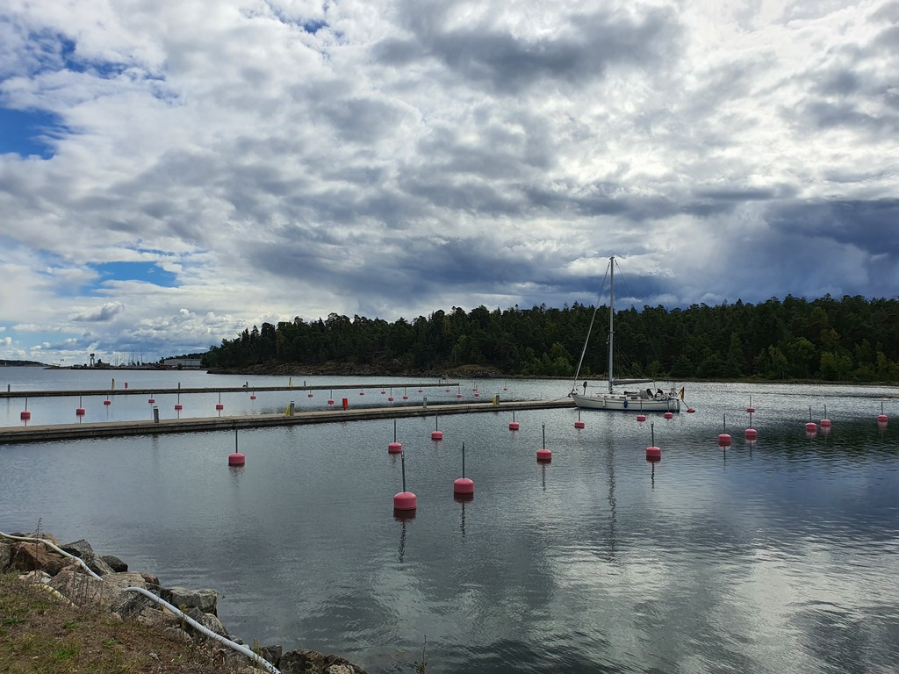

We left the buoy after a lazy morning, and sailed west mostly on a beam reach. The fairway here sure is narrow in places!

 

The marina in Oxelösund is a good example of Sweden off-season. The piers are empty, and apparently we'll be able to pay the harbour dues tomorrow when the harbour master comes to clean the toilets. Very basic facilities, but should be ok for this weekend's crew swap.

* Distance today: 10.9NM
* Total distance: 2043.5NM
* Engine hours: 0.8
* Lunch: pea soup
