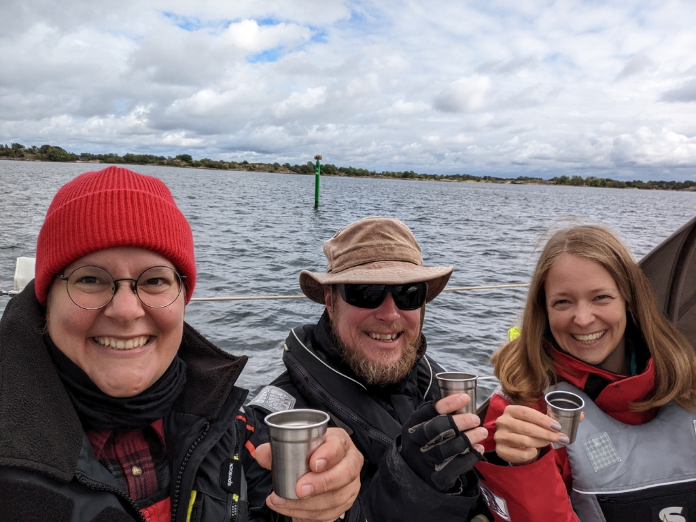

Rainy morning turned into a sunny afternoon while we sailed through the archipelago. Our route was taking us a bit on every course so we had everything between head wind to broad reach. We crossed the open water part from Oxelösund to St Annas archipelago. 

In the st. Annas archipelago we passed "kejsaren" again, and toasted to it as the local customs dictates. How Kejsaren became kejsaren there are many stories but passing it without a toast promises bad luck. Skål!

 

Getting close to the Harstena island we saw 2 sea eagles sitting on top of a rocky islans. They truly are huge birds. Along the way we watched the start for the Golden Globe Race 2022. Felt specially awesome to watch it under way. For us the most interesting boat is Olleanna, an OE32, which is a very similar boar to our dear Lille Ø. Not forgetting our countryman Tapio Lehtinen on his Asteria, a Gaia 36. Wishing fair winds to them all on their long and lonely passage.

* Distance today: 27.9NM
* Total distance: 2071.4NM
* Engine hours: 0.8
* Lunch: Miisa's couscous salad
