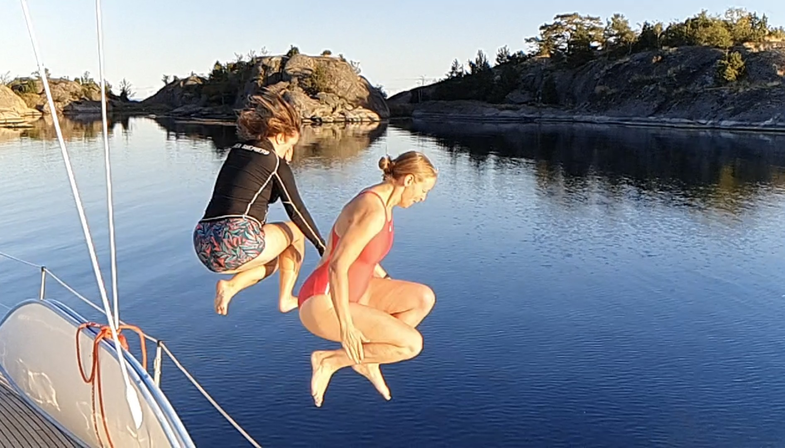

The morning rain ended exactly when we wanted to start preparing the boat. A slow wind day, we left Harstena on a broad reach.

Just before lunch a seal popped up next to the boat, making Darth Vader sounds.

 

After a slow but nice sail we arrived to a SXK buoy on the rocky shores of Jungfruskär, right off the main fairway leading to Västervik. Time for a quick swim before sundowners.

* Distance today: 21.5NM
* Total distance: 2092.9NM
* Engine hours: 0.8
* Lunch: macaroni casserole
