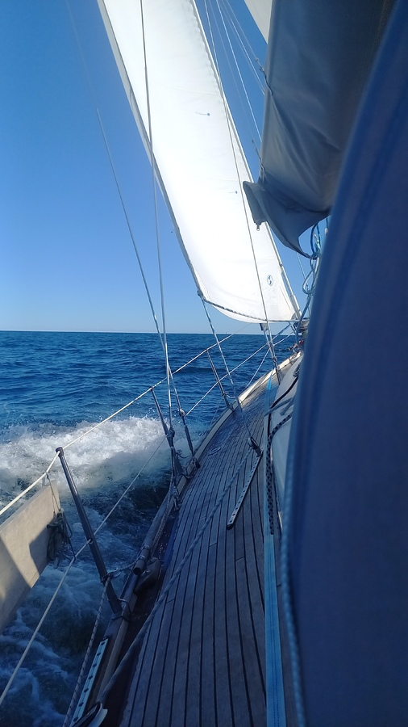

Morning departure was easy enough: coffee, packing the FLINsail, detaching from buoy, and hoisting main.

The beginning of the trip was again slow going on a broad reach with minimal winds. That gave us ample time to watch the sea eagles (15 of them!) soaring on thermals from the sunny cliffs.

 

As the wind started filling out, it also turned southerly. This meant tacking. Passing Västervik we mostly did long leisurely tacks off shore, but then as the waves started building up we came back to the fairway and short-tacked the rest of the way.

* Distance today: 37 NM
* Total distance: 2129.9 NM
* Engine hours: 0.7
* Lunch: tofu curry with rice
