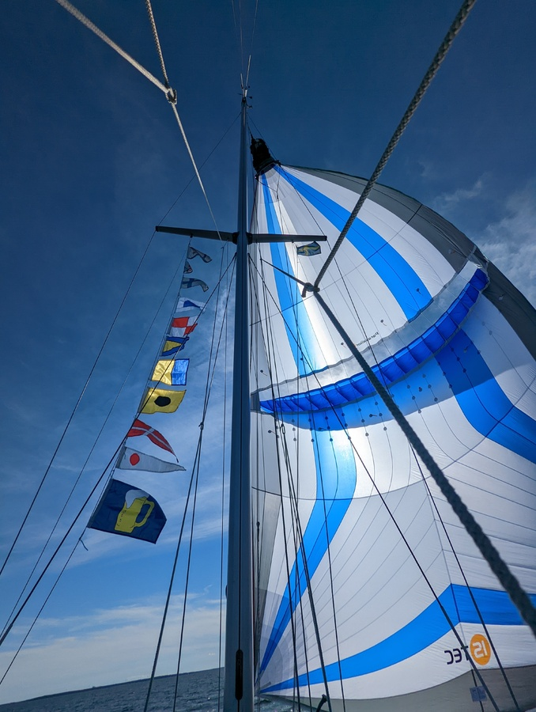

Suski's birthday meant starting the day with the party flags. Then breakfast and under way.

 

What a beautiful sailing day! Between 8 and 13kt on the port quarter. We started with a poled-out jib, but then seeing the conditions rerouted ourselves to the offshore way and hoisted the Parasailor.

Now we're back in the southernmost nature harbour on the Swedish east coast. Here we started our Scandic mooring experience almost four months ago.

* Distance today: 25.6NM
* Total distance: 2155.5NM
* Engine hours: 0.8
* Lunch: feta avocado salad
