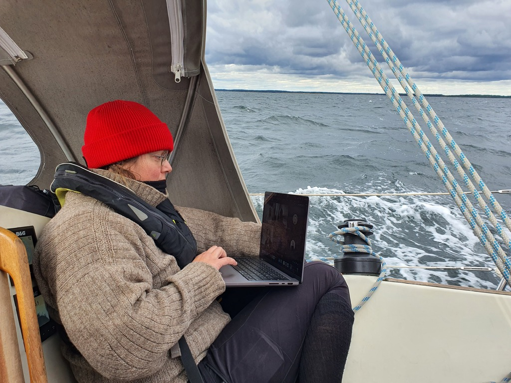

With a forecast of wind increasing over the next two days, we decided to have an early start. Fortified by French omelette and coffee we hoisted anchor and headed on the southeast-bound fairway.

As we reached Kalmarsund proper, the wind did indeed increase. We were flying down the straits with 20-31kt on the beam and first reef.

 

With this fast passage we reached the Kalmar guest harbour already at 2pm. Now for some rest, sauna, and provisions. Tomorrow there is a gale in the forecast, so we'll stay here.

* Distance today: 38.6 NM
* Total distance: 2194.1 NM
* Engine hours: 1
* Lunch: pea soup
