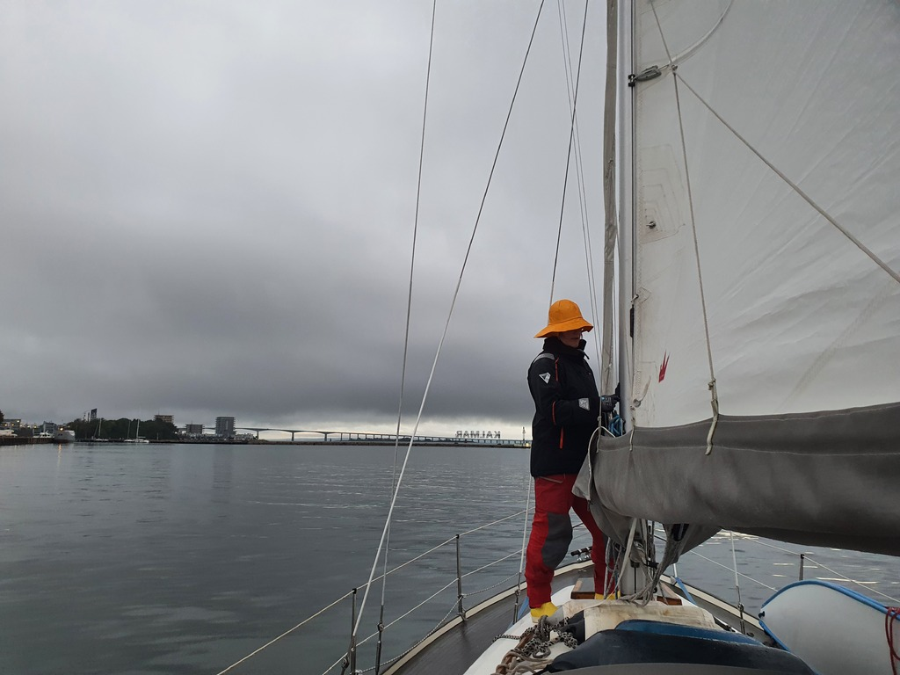
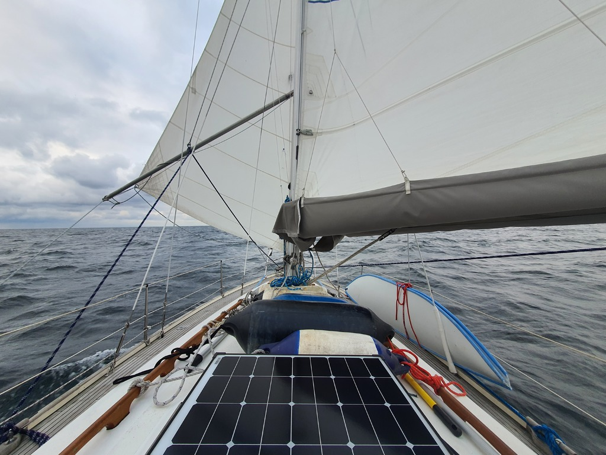
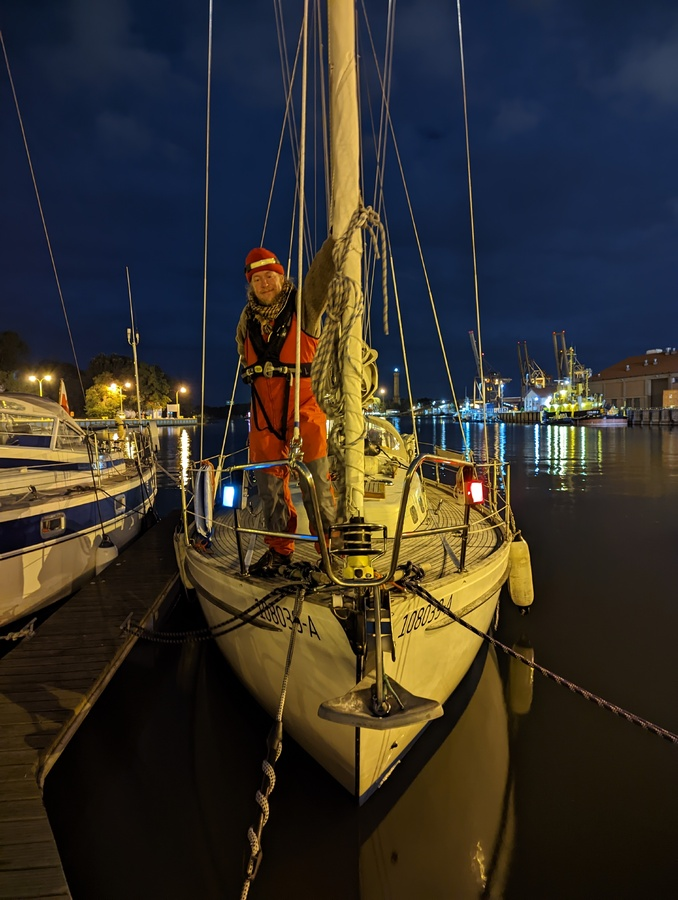

Weather window. That was the topic of the week as we were intensively looking at weather and waves of the southern Baltic Sea. The scheduled 1 month long closing of the Hohensaaten West locks is happening in 2 weeks. As Suski is now limited to only sailing the weekends, we decided to take the half good slow or no wind option now.

  

 

The trip was exactly that. Slow going with fairly big waves and annoyingly waves from 2 different directions. During the passage we had some very nice going with beam reach and also flopping along with dead down wind with only 5 knots of wind. The slow going meant that our sails were flapping alot and at times we successfully reduced the sail area for the off watch to be able to sleep. This time we ran 6-on-6-off system and we might stick to this as there is more uninterrupted sleep available.

 

The flapping of the sails eventually led to 2 cars of the mainsail to break. We took the sail down, added a replacement and repurposed a car from the bottom of the sail so we still had a properly attached sail, but only in 2nd reef. The lesson here is that we should've replaced all the cars when one broke back in June.

At this point our going and wind slowed down significantly so we tried the Parasailor. It didn't fill in properly either with the 6 knot winds and the confused swell. So with 50 NM left to go, we turned on the engine and motored the rest of the way to be able to leave at least some sleeping time before the working week.

 

We arrived in Świnoujście little after midnight on our second moonlit night. The marina has streetlights around it, so arriving at night is not a problem, at least now that there are fewer boats out sailing.

* Distance today: 185.4 NM
* Total distance: 2379.5 NM
* Motor hours: 14.1
* Lunch: pizza, shakshuka
