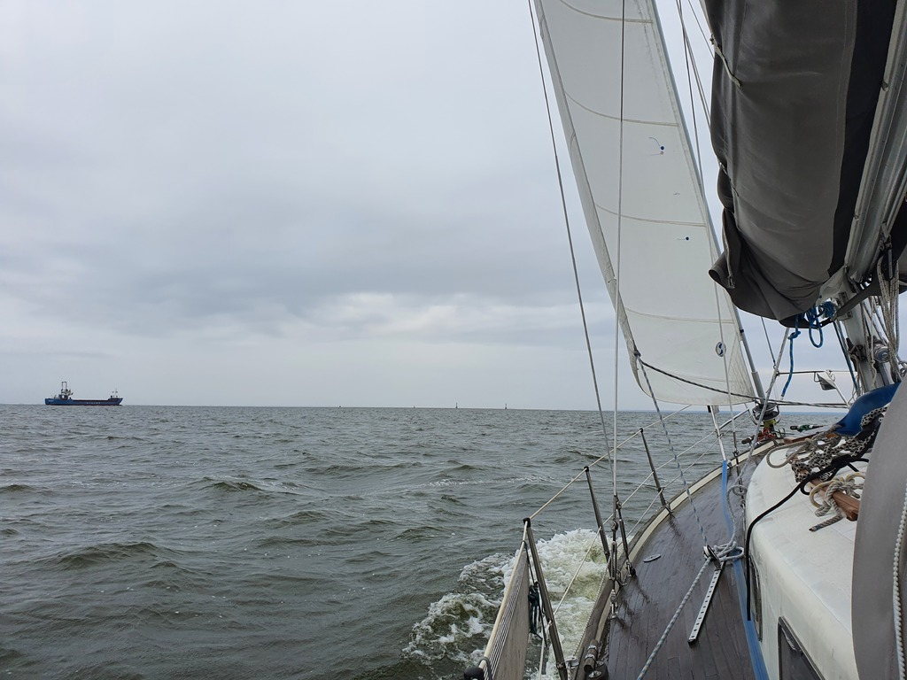
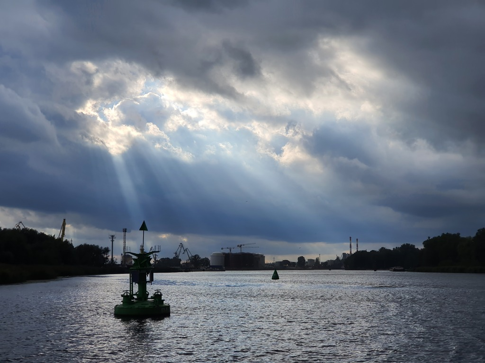

We left the marina at Świnoujście in the morning under heavy rain. Then it was time to navigate the channel dodging various tankers and cargo ships. Luckily the skies cleared a bit.

 

At the Szczecin lagoon we were able to set sail. Wind was on the beam, and with that we made good speed across the lagoon even though we could only use the 2nd reef due to the missing batten car.

 

After the lagoon we continued motoring through the huge industrial harbour. We finally arrived to the Szczecin academic sailing club, found a box for the boat, and booked mast crane for the following morning.

* Lunch: feta avocado salad
