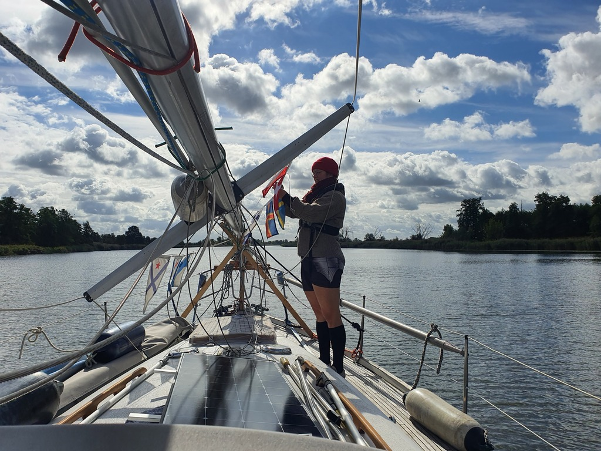
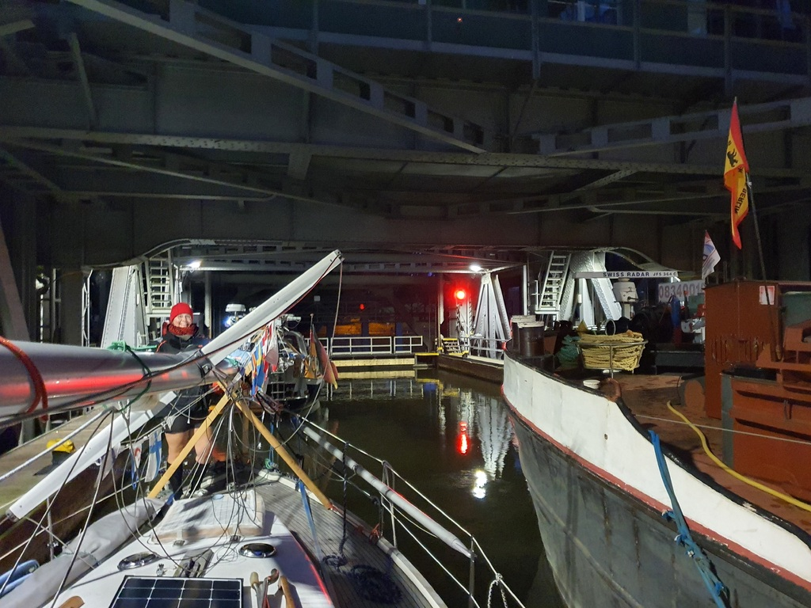

After breakfast it was time to leave Poland and the Baltic Sea behind. We motored to the notorious low railroad bridge at Podjuchy. Last time it had been closed for traffic, sending us on a long detour through the Szczecin city center. This time we had consulted the local [Notices to Mariners](https://szczecin.wody.gov.pl/komunikaty-nawigacyjne/114-nieprzypisany/1311-navigation-announcements-2023) and hence were able to time ourselves to a bridge opening. Six meters of clearance instead of three is a big difference!

 

When we reached the German border we replaced the lone Polish courtesy flag with a string of all countries visited on this five month trip. Then we continued along the scenic Oder valley nature park, watching eagles and beavers at their work.

 

We soon encountered a barge heading the same way and nearly the same speed, and tagged along. This made handling oncoming traffic a lot easier, and eventually enabled us to get straight through both the Hohensaaten West locks and the Niederfinow ship elevator.

 

Now we're parked for the night on the elevator's upper sport boat waiting area. There were two other boats planning to spend the night there, and as the one that had arrived earlier had parked in the middle hogging the whole space, fitting in required some tight manoeuvres.

* Distance today: 51.8NM
* Total distance: 2468.5NM
* Engine hours: 11.8
* Lunch: Miisa's couscous salad
