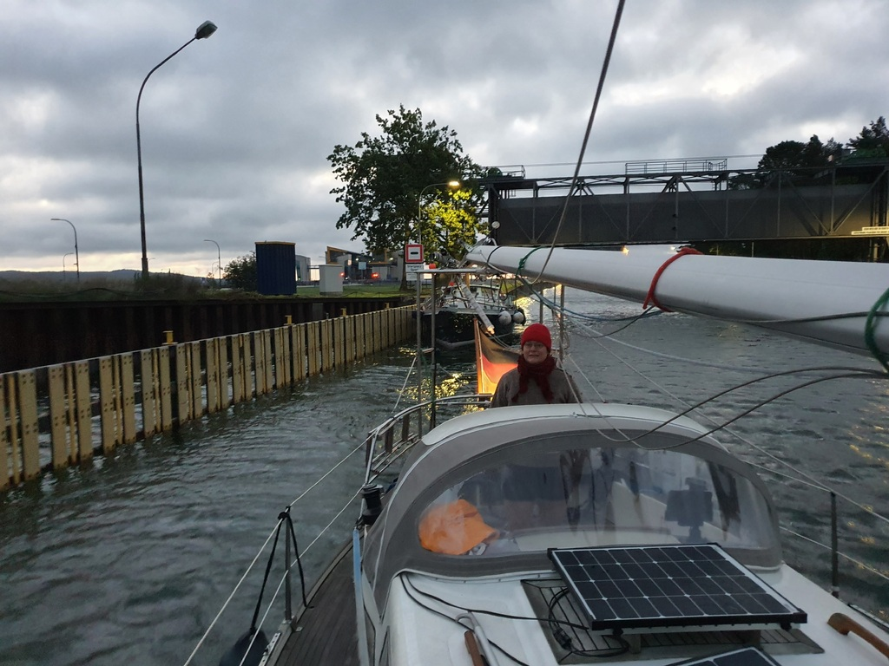

 

Wake up call at 5:30, safety coffee and onwards with the journey towards home port. With the early start came the joy of not having much traffic. When we reached the part of the canal under construction, we again radioed the various tug boats to ask for a suitable moment to pass. At one point we were requested to wait for a bit, so we did 2 donuts before given the permission to pass. Cheerful Danke Schön and Bon Voyage were exchanged with the crew when we were at talking distance of them. Combination of transmitting AIS and a working radio also when the mast is down removes stress out of tricky traffic situations. 

At Lehnitz locks we waited for an hour before we could enter. Towards Spandau we kept slightly higher travel speed as we wanted to cluster up with the cargo ship and the sailboat we had already shared both Niederfinow and Lehnitz locks with. The plan only semi worked as we all needed to wait at the Spandau locks. While still all lights red, the shipping police just ignored all of them and drove in, followed by the cargo ship and all of us small boats.

We arrived at Gothia at 17.
