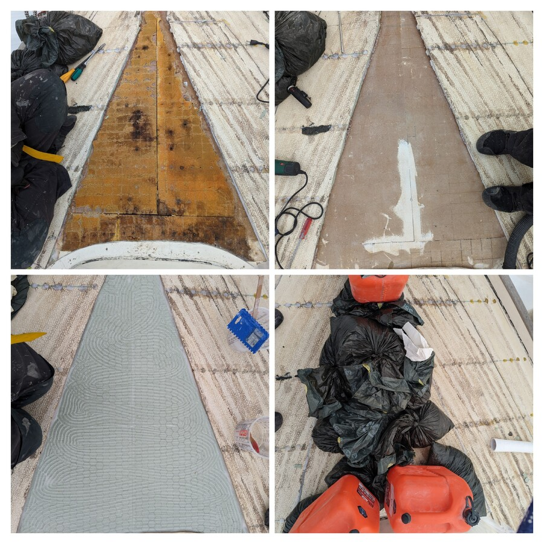
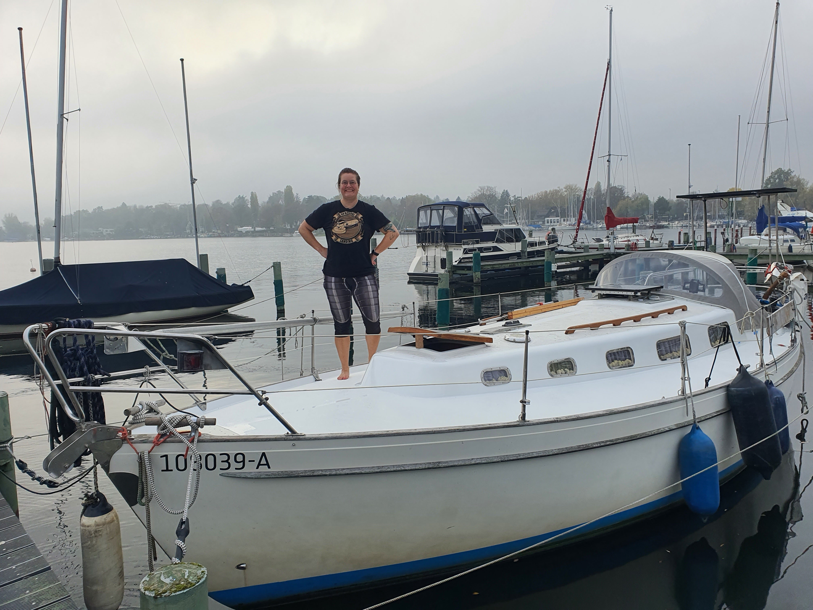

Since coming back we took the boat up, washed the hull and patched the minor dents in the keel and started what we anticipated to be a couple week teak deck removal and painting of the deck.

That teak removal project quickly turned out to be a complete deck rebuild as we found out that our entire deck core was soaking wet and partially delaminated. The teak had hidden the underlaying faults well.

So the quick project became a mountain of work. With the help of the excellent book [This old boat](https://www.goodreads.com/book/show/1012547.This_Old_Boat), the deck replacing project by Mads in the [YouTube channel SailLife](https://youtube.com/@SailLife) and all the tips tricks and wisdom shared at the club terasse we set forth on this mammoth project. 

 

I have never heard *"Ach du Scheisse!"* repeated at me so many times and with such profound intonation when I explained what we had found and what we were about to do. Armed with determination and conviction and help from our friends we planned out the project and set to work. We kept the boat in the water, put a tarp on top of the mastless deck and hoped for suitably warm weather to aid us in finishing the project.

The warmest october in Germany since records began helped us push through what ended up being 5 weeks of hard work. It became our tradition to give a small progress report at the Sunday breakfast club table. Those warm words of encouragement from the breakfast club were at times the only thing keeping us going. 

So what did we do? 

 

* Cut the deck open in sections with a circular saw
* Cut and scratch out the old foam 
* Let the section dry and opened up the next one
* Shape the new foam core to fit the hole
* Epoxy it to its place
* Epoxy the cleaned up old deck surface back on
* Weight it all down with bags of sand
* ...and repeat the process until we were done with the rest of the deck.
* When the new core was in, we took the angle grinder to the whole deck and cut a 1:12 bevel into the 'seams' we had cut.
* After grinding we vacuum cleaned the deck and as final preparation wiped the deck down with acetone.
* Then it was time to fill the bevels with both woven and chop strand glassfiber mats.
* When the deck was again at its full thickness it got sanded, faired and painted (interpotect, perfection under and overcoat + kiwigrip at the top).

 

 The end result was a shiny white deck ready for the next 20 years of sailing!

 Thank you so much Anatol, Andy, Bernhardt, Daniel, Martin and Philip!
