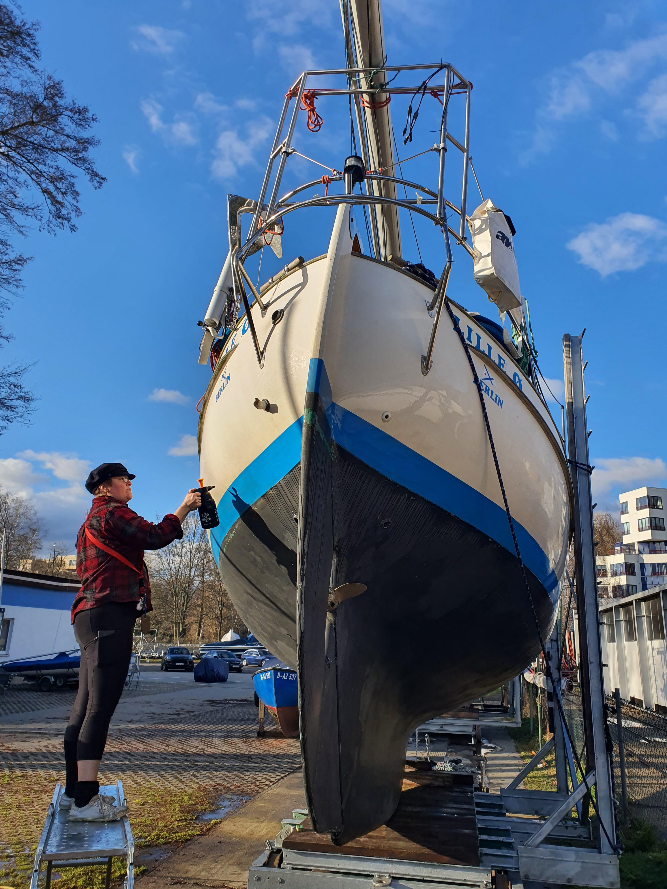

The project season is on its last legs, and soon we can head towards north again. After the [deck rebuild](https://lille-oe.de/2022-11-28/), we took a month off from boat projects and enjoyed some sailing and anchoring on Havel. After the well needed rest we cracked on with the following projects:

- New through-deck mast cable connector
- New sails: main, genoa, staysail
- Removable inner forestay
- Rope clutches for all halyards
- Rod kicker
- New topping lift
- New folding winch handles
- New diesel heater (twice!)
- Rebedded all deck hardware
- Dyneema lifelines
- Side boarding ladder
- Double glazing for portholes
- Boom preventer lines brought to cockpit
- New fixed Solar panels
- Watermaker installation
- Widened port side saloon settee
- Replaced saloon table with a mount for the cockpit table
- Replaced gas stove with a gimballed alcohol stove and electric air fryer
- New galley light 
- New saloon and galley carpets
- Orca Core gyrocompass
- New tablet chartplotter (Galaxy Tab Active3)
- Data connection between the ST4000+ autopilot and Signal K
- DC-DC converter for powering the heads fan from boat battery
- Insulated heads ceiling
- Fenced off the technical compartment to allow some storage in quarter berth
- Sea water tap for the galley
- New [electronic logbook software](https://bergie.iki.fi/blog/electronic-logbook/)
- Migrated almost all storage to waterproof plastic boxes
- Keyfob remote control for the saloon lights (light up the boat when getting near with the dinghy!)
- Digitised the paddle wheel log sensor and integrated with the NMEA2000 bus
- Washed and waxed the topsides
- New layer of antifouling 
- Serviced the feathering propeller
- Annual engine maintenance

As one can see, we were not idle during the winter. Now we feel that Lille Ø is ready for the summer. We have a more flexible sailing setup and we hope to be able to stay in the beautiful natural harbours longer than before.

