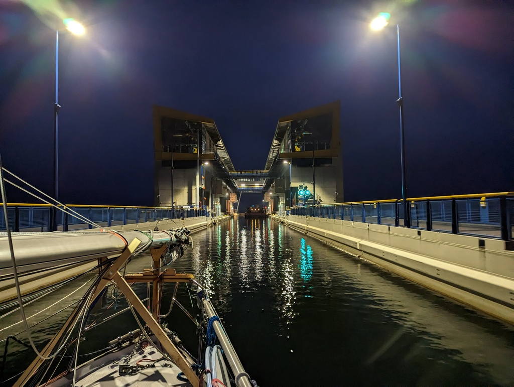

The morning started with finishing the last project: fastening the windvane bracket to the hull. At 10 we cast off our lines and hooped the signal horn 3 times to mark the start of the summer's cruise. A small <a href="https://scgothia.de/gute-fahrt-lille-o/">fairwell committee</a> hooped their answer and we motored away.

The overcast morning turned into a sunny day while we motored towards north. After Lehnitz locks we could follow kingfishers hunting along the canal edges. The radiant blue plumage shone especially bright against the dull browns of the early springs background.

At dusk we arrived to Niederfinow boat elevator and were slightly confused about all the blinking lights. A quick verification from Elwis and we made our way to the sport boat waiting area of the new boat elevator. A short call with the lock elevator operator, and we waited for a cargo boat to enter the boat elevator before us and then made our way in to the huge elevator cradle. The massive piece of engineering gave us a smooth ride down and as by now it is pitch black we will stay in the lower waiting area for the night.

The summer adventure has begun!

* Distance today: 44 NM
* Total distance: 44 NM
* Engine hours: 8.7
* Lunch: Oven feta pasta
