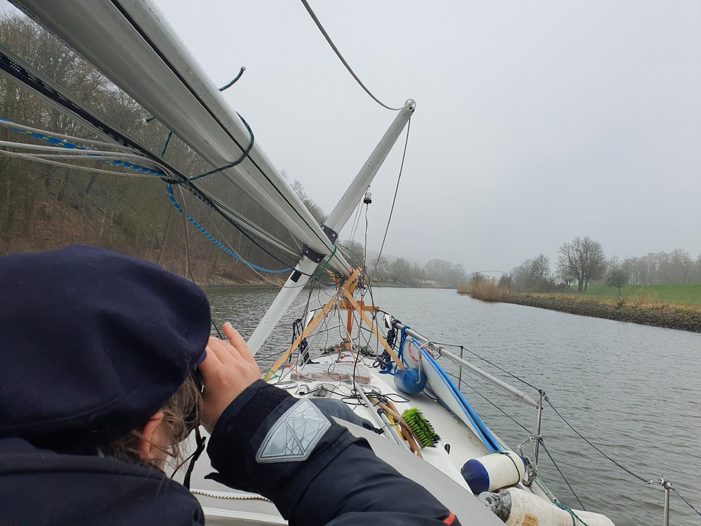

We started the morning with an early coffee and departure, as we wanted to clear the sport boat waiting pier before the ship elevator started operating at 6am. The Order valley opened before us foggy and cold, but thankfully with enough visibility to motor onwards.

 

Like with the previous locks, we got a private opening at Hohensaaten West. Now we were basically at sea level! The canal was really quiet thanks to Easter. We passed the only ship of the day at Oderberg.

Due to the cold weather we decided on a two hour watch schedule. Tea in thermos for the watchkeeper, and a 12V electric blanket for thawing the off-watch.

 

As always, the Oder Valley was bustling with wildlife. Suski's bird watching log got 12 new species.

Sun came out finally as we approached Szczecin. The dreaded low railway bridge is now gone, and we were able to navigate directly to the AZS marina without any hindrances. Booked mast crane for tomorrow, and now we may enjoy a cold "anleger" in well-earned sunshine.

 

* Distance today: 51.8NM
* Total distance: 95.8NM
* Engine hours: 9.5
* Lunch: lentil-shiitake-coconut curry with garlic bread croutons
