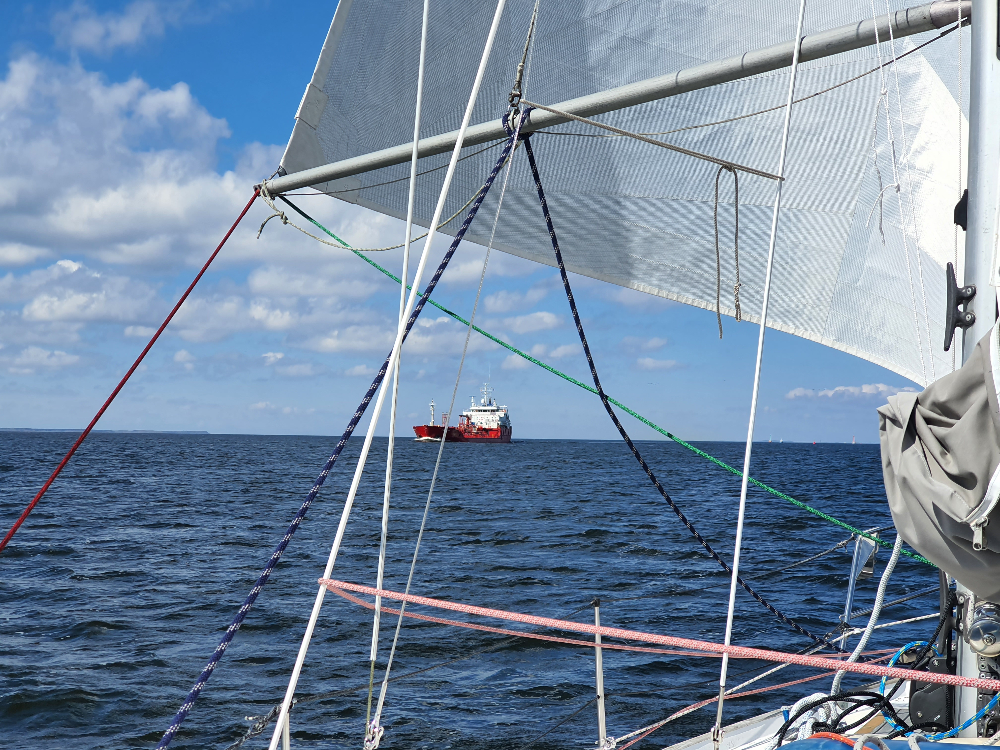
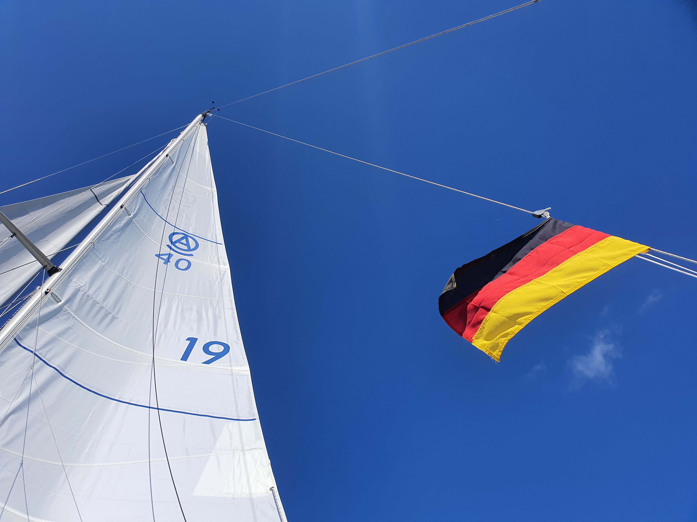

We had an early morning to finalise the hydrogenerator wiring. Then we headed north through the busy Szczecin harbour. Another workday meant a single-handed sail.

Right when the channel started widening north of Dabie, the wind also picked up. For once we'd have a downwind run through the Szczecin lagoon.

 

Sails up assisted by the autopilot, then setting up wing-on-wing configuration with a prevented boom and poled out genoa. The early part of the trip required couple of gybes, but once we reached the lagoon, going became a lot easier. Just lean back, focus on keeping watch, and let the autopilot do the work.

We used this opportunity to test our newly-installed hydrogenerator. A separate post on this will follow, but the gist of it is that it works! When we sail at 5kt or above, it covers our electrical consumption. Day and night.

 

Once we reached the Swinoujscie channel, we dropped sail and proceeded under motor to the by now familiar Marina Swinoujscie. Now we're at the sea proper! Next we'll have to wait for a weather window to sail further. Right now the forecast for next weekend doesn't look promising, but we'll keep an eye on it.

* Distance today: 37.6NM
* Total distance: 133.4NM
* Engine hours: 3.6
* Lunch: shakshuka
