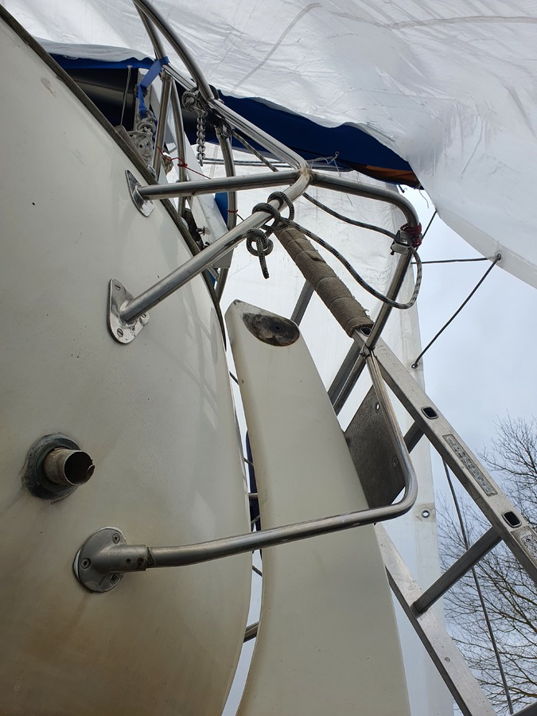
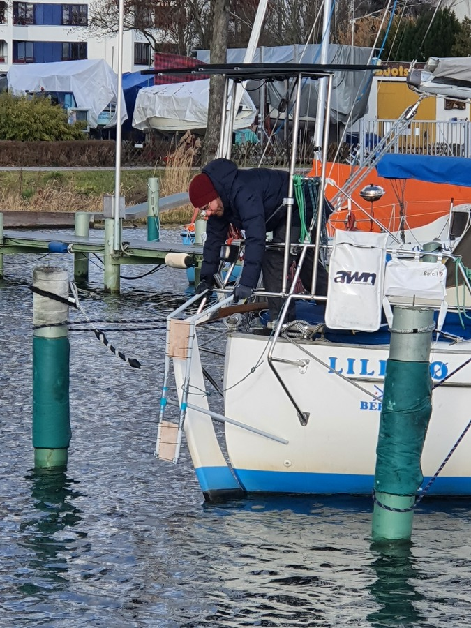
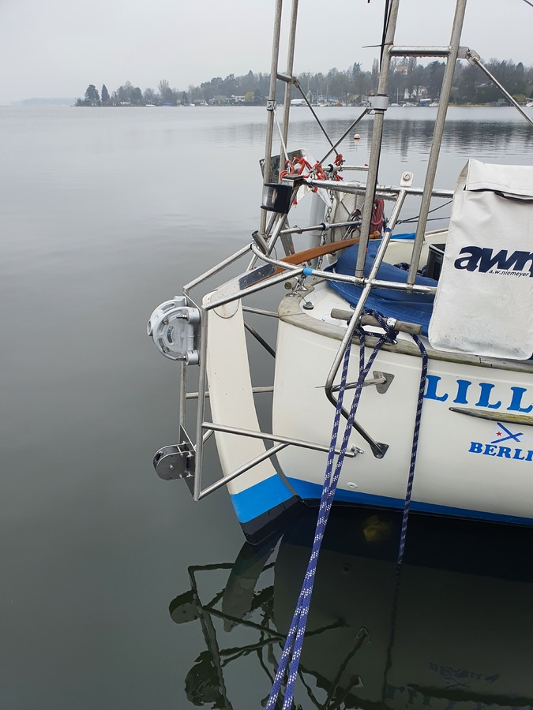

We're now sitting in the rolly Marina Swinoujscie waiting for the weather to improve. This has given us the chance to complete some of the projects we couldn't get done before leaving Berlin. The biggest of those was the self-steering windvane installation.

<!--more-->

### Self-steering windvane

A reliable self-steering system is a critical safety feature for short-handed crews. Sure, we hand-steered [our way across the Atlantic](https://bergie.iki.fi/blog/sailing-across-the-atlantic/) last time, but that was with a crew of 27 people.

On Lille Ø we usually sail with just a [crew of two](/crew/), meaning that it is essentially single-handed sailing done serially: one person is on watch, and the other rests or cooks. In these situations not being tied to the tiller is critical, as it frees the on-watch to focus on navigation, dealing with traffic, and trimming the sails.

For the past two years, steering has mostly been handed by [Assistentti Nissinen](/crew/#assistentti+nissinen), our Raymarine ST4000+ tiller pilot. This has worked well enough, and I think of [last summer's 2.5k miles](/2022/) the tiller pilot steered 2k. For our upcoming trips we however want more capability and redundancy.

> Windvane or autopilot, whichever is selected, must work and go on working. Each has its strengths and weaknesses. The best answer is to opt for both. 
\- Tom Cunliffe, The Complete Ocean Skipper

This is where [a self-steering windvane](https://en.wikipedia.org/wiki/Self-steering_gear#Mechanical) comes into the picture. There are two primary types: servo-pendulum, and auxiliary rudder. We liked the simplicity of the servo-pendulum setup, and the fact that it steers the boat using the rudder the naval architect designed for the purpose.

One problem with fitting gear like this on a "spitzgatter" like ours is that we don't have a flat transom where to bolt things. Instead, we'd need a custom bracket to mount it. The German [WindPilot Pacific](https://windpilot.com/n/wind/en/prod/paci/) is a product we've heard good things about, and we knew that it had been fitted on many [other Amigo 40 boats](https://windpilot.com/n/wind/en/foto/paci/Amigo40). This meant we had a starting point.

I contacted our stainless fabricator in the fall to ensure the bracket could be built in time. We also got in touch with the owner of another Amigo 40 in Berlin, and went to check out and measure his WindPilot Pacific bracket.

### Hydrogenerator

Apart from self-steering, the other major area we wanted to improve this winter was energy independence. Thanks to the [FLINsails](https://flin-solar.de/flinsail), we mostly had enough power during last summer. But there were times when we still had to go to a marina and plug in.

We knew we'd need some other renewable source apart from solar. I [made some calculations](https://gist.github.com/bergie/6de660b18fd0994286ab085d68e4fe44) based on our 2022 numbers, and they showed that adding a hydrogenerator would get us over the line -- at least for the summer months.
There was a [lengthy CruisersForum thread](https://www.cruisersforum.com/forums/f14/solar-vs-wind-vs-hydro-272127.html) discussing my findings and going over various improvement ideas.

Hydrogenerators are devices resembling an electric outboard that you tow behind your boat. The motion of the boat through the water is turned into electrical generation. The faster you sail, the more the generator produces. This is similar to a wind generator, except that since water is thicker you need a lot less speed to produce power. It also works better when sailing downwind, when apparent wind is reduced by the boat speed.

One big question was how the hydrogenerator would fit together with the windvane. We saw several of the [GGR](https://goldengloberace.com) boats with a Watt&Sea on the side. However, that device is prohibitively expensive. Having seen a [blog post from WindPilot discussing the SailingGen hydrogenerator](https://windpilot.com/blog/en/equipment/joint-venture/) we knew that the two could fit together.

We got in touch with the [SailingGen vendor](https://sailnsea.1a-shops.eu) to check this idea, and got back a response that he had called WindPilot and they had come up with the following scheme:

Now it was time to order stuff.

### WindPilot factory visit

Peter from WindPilot suggested that since we were in Berlin and his workshop is in Hamburg, we'd come and pick up the windvane from there. This would not only save us the shipping costs, but also allow us to see the factory and have a chat with the maker of these devices.

Together with the crew of the Great Dane 28 _Gaviota_ we made a fun weekend roadtrip to Hamburg, picking up the obligatory [Elbsegler-hats](https://en.wikipedia.org/wiki/Mariner%27s_cap) from a [local hatmaker](http://www.muetzenmacher-hamburg.de).

It was great to see the WindPilot workshop. We got to see the huge stacks of windvanes being prepared, as well as all the precision machinery used to build the various components.

The intended short factory tour ended up being over two hours of discussion with Peter. Topics ranged from windvane usage and installation to varioud cruising boat outfitting topics, as well as the GGR and the recent sinking of Tapio Lehtinen's _Asteria_.

Once the WindPilot and the SailingGen were packed in our locker back at [Gothia](https://scgothia.de) it was time to turn our attention into the bracket design.

### Designing the bracket

After some discussion with our stainless fabricator, as well as both vendors, it was deemed that it was best that we'd design the bracket ourselves all the way to a prototype stage. We started with a sketch to get feedback from all parties:

Some adjustments were needed, mostly to bring the windvane bracket a little higher, and the hydrogenerator bracket closer to the waterline.

Once the basic design was agreed on, the next step was to build a model from PVC pipe and some spare plywood. With this we were able to do the first test fit.

Once this had been deemed acceptable, it was given to the stainless fabricator. It was time to transmutate plastic into steel!

This took some iterations, but eventually we had a version that fit.

A couple of days before our departure for the summer's cruise, everything was ready. Now we just had the scary task of drilling some holes to the hull, applying sealant, and installing the bracket itself.

### Device installation

We decided that the rest of the installation would be easier in Szczecin. After we got our mast up, we backed up into one of their empty boxes and installed both the hydrogenerator and the windvane. Everything fit just right!

Here are both deployed:

And this is how they look stowed:

In Szczecin we also completed the electrical wiring needed for the hydrogenerator. To get the data into our Victron VRM system, we added a SmartShunt to the setup to measure the output. On way to Swinoujscie we were able to do a proper test run:

Here are how the initial numbers look like, amps produced by the hydrogenerator (@12V) graphed together with boat speed through water in knots. Note that this was a sunny day, so the hydrogenerator output was being somewhat throttled by the solar panel output.

In Swinoujscie we finished setting up the control lines for the windvane:

Now everything should be ready for the summer's cruise. We'll be posting usage experiences on [our blog](https://lille-oe.de) as we go along.

_Thanks to Peter from WindPilot and Armin from SailingGen, as well as Ritchie from Gothia. This wouldn't have worked without you!_
