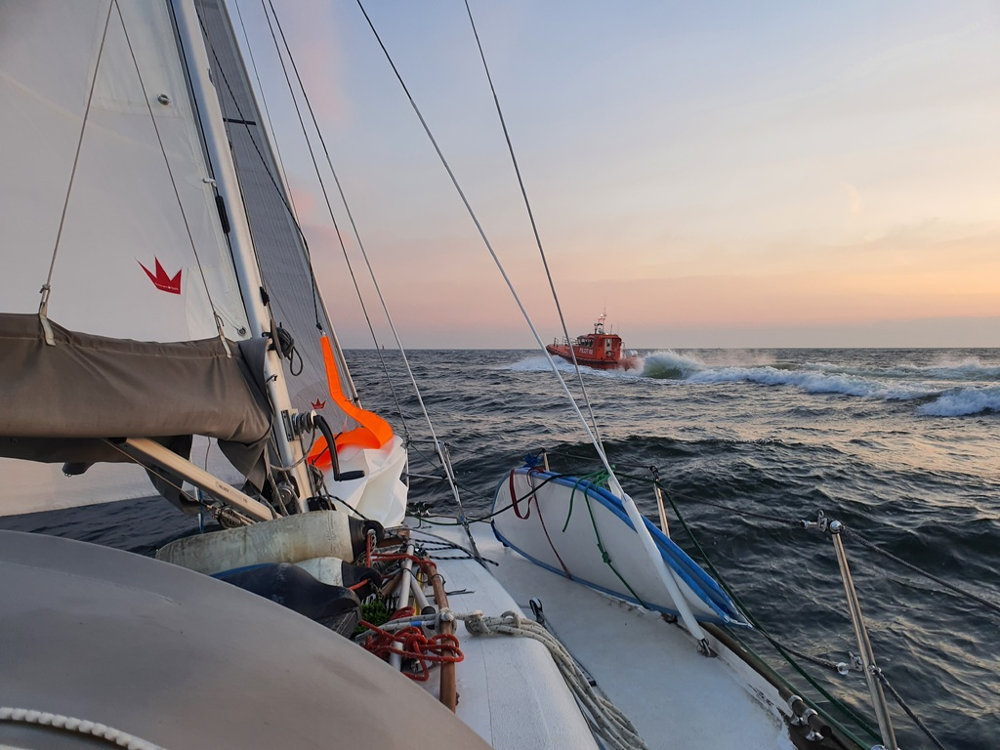
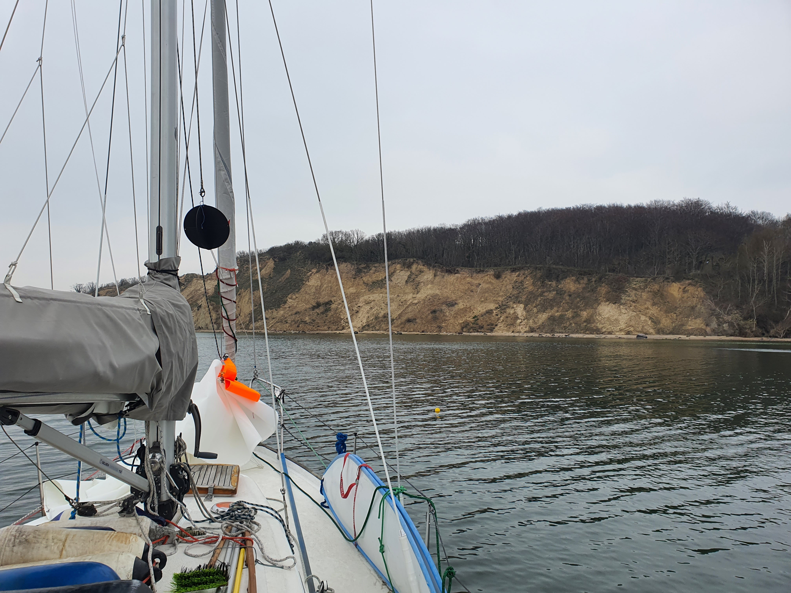

The morning started very early as we wanted to gain as much space between us and the lee shore of Usedom with the easterly breeze. Sails went up at 6am at the same time with the rising sun. Finally we were at the sea!

As the northeasterly winds are forecasted to prevail for the next week, we decided to head for a small excursion towards the German island of Rügen instead. Just like for the migratory birds gathered around us, this is a great staging area for heading northeast when the winds turn.

 

The day before we planned to leave with the staysail and the main in first reef, but as the morning greeted us with half of the expected winds, we went out with the genoa and the full main. One hour later the forecasted winds arrived and we battled the genoa back into a roll and hoisted the staysail instead. After a quick recovery break, the main was reduced to first reef. With the wind now blowing over  20kn we did not even slow down with the new setup as the sail balance was better and we didn't have a weather helm to fight. 

With the balanced sail setup it was time to test out the WindPilot! We lowered the servo rudder, attached the wind vane and set up the ropes but did not yet attach them to tiller. Then we figured out neutral position of the wind vane and attached the chain to the tiller. Wit a couple of tweaks on the wind vane angle we were pointing towards the first waypoint! What a feeling! Gliding through the one meter waves, nothing but the sound of wind and sea surrounding us. What a way to travel! 

We passed Greifsvalder Oie from the north and turned slowly towards the south side on Rügen. Only at the very end we started hand steering again as there are some good few shallows along the way. Now we are tucked behind the high shores of Rügen enjoying some peace and quiet.

 

* Distance today: 38.2NM
* Total distance: 171.6NM
* Engine hours: 0.7
* Lunch: pizza
