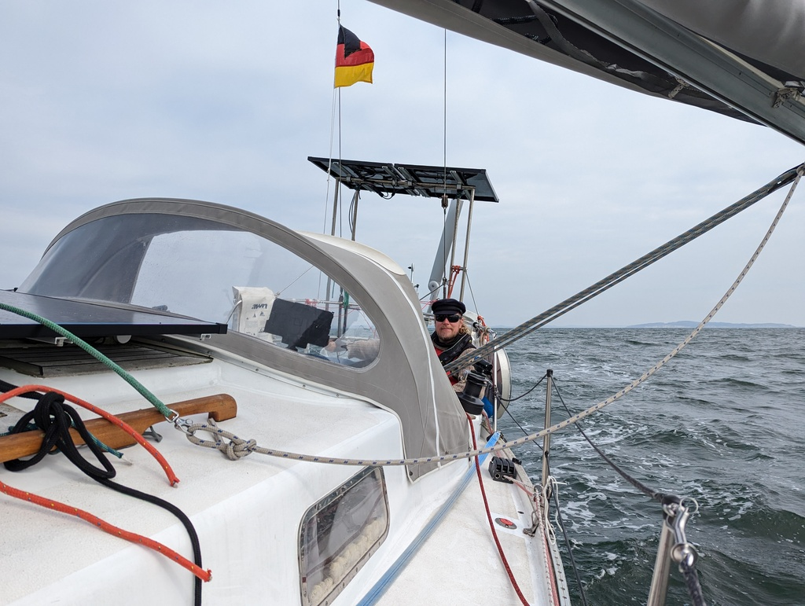

We started the day with a big Sunday breakfast. Then boat ready and underway.

The anchorage where we had spent the night was scenic, but we would need better internet for the upcoming work week. [Boater's Atlas](https://boatersatlas.com/) had luckily some connectivity ratings for this area shared by fellow cruisers. There we spotted an anchoring spot along Strelasund with good numbers.

Since this would be a downwind run, we prepared with the full main and genoa, which we soon poled out. Anchor came out almost clean thanks to the sand.

Most of the trip was at comfortable slightly above 5kt of boat speed in the gentle swell of the Greifswalder Bodden. Hydrogenerator was churning, and as yesterday, we ended the sail with battery about 10% higher than when we hoisted the anchor.

 

Turning half wind into Strelasund, we had to contend with a ferry as well as a fishing competition where a few of the participants were drifting on the fairway. Then sails down and motoring on the narrow channel to our destination.
Two flagged buoys, one on each side of the fairway, caught out attention -- surely nobody would set a fishing net across?" We ghosted closer, and the flags had a "no fishing" sign. So apparently just marking this bay as a no-fishing zone.

The anchoring bay is windy, shallow, but free of swell. And with good internet.

 

* Distance today: 16.5NM
* Total distance: 188.1NM
* Engine hours: 1.1
* Breakfast: avocado and fried egg toast
