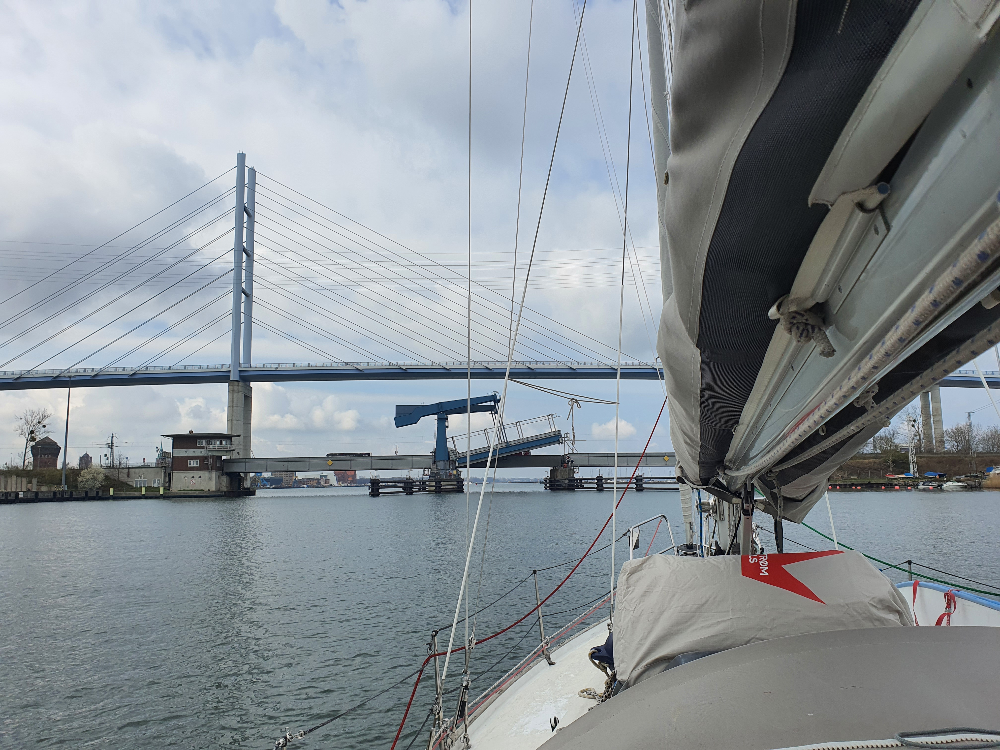
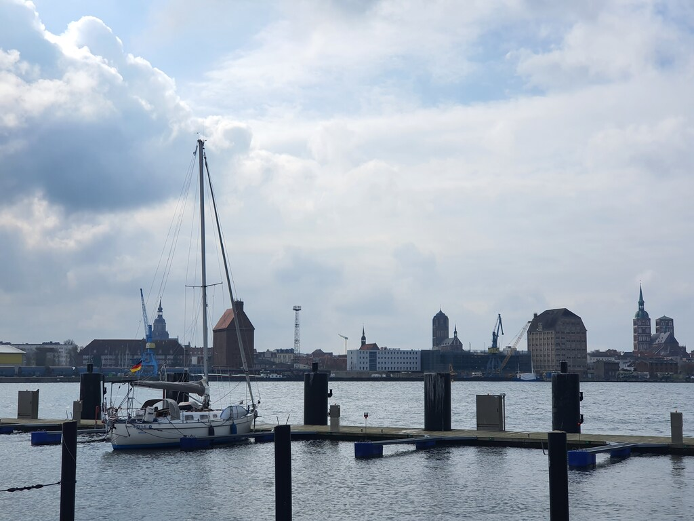

Today's sail was to be a short one: a downwind run from our anchorage to catch one of the six daily bridge openings at Rügendamm.

Wind was light, so we went with the full main and genoa, until it was time to reduce sail in order to not overshoot the bridge schedule.

We had a lunch underway, then dropped sails and went into a holding pattern. The bridge opened for us and we motored into the Stralsund harbour.

 

We're now moored in Dänholm, across the Strelasund strait from the picturesque Hanseatic city of Stralsund.
We will stay here for this week as Suski needs to do a business trip to the Alps.

 

* Distance today: 8.6NM
* Total distance: 196.7NM
* Engine hours: 1.2
* Lunch: spaghetti with avocado sauce
