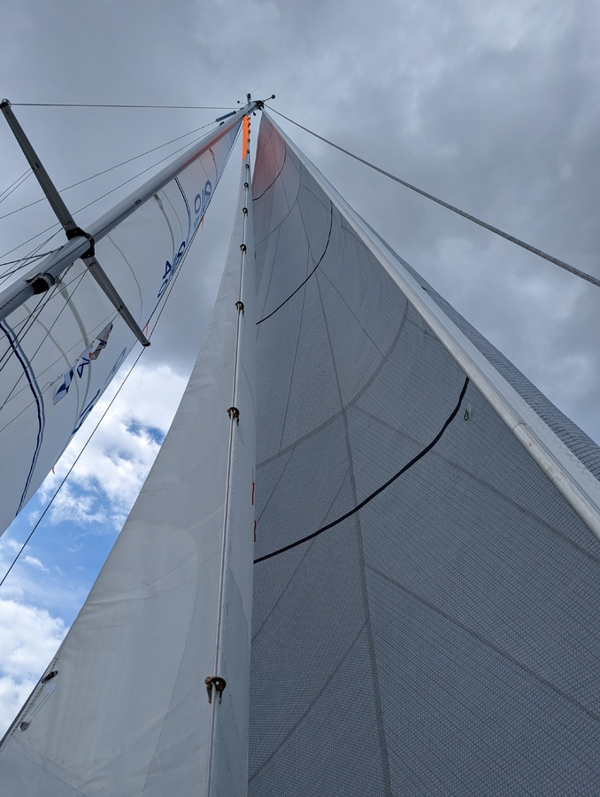

When is the correct time to leave for a passage is a question that has never just one right answer. When are the winds and waves suitable? When can the crew go? What is the expected traffic situation? Are you willing to motor when necessary or is it pure sailing? Which of the weather forecast models do you rely on?

For us this time it was the correct weather, reasonable waves and finally both of us back on the boat. Also Bergie needed to be somewhere with good internet for a meeting so a Monday midday start with arrival either to Tärnö on Tuesday afternoon or Simrishamn on Tuesday morning. The route promised light winds for the start and stronger winds for the evening and night.

With a beneficial wind we sailed the narrow fairway towards Hiddensee. It is a slightly insane feeling to have _all_ the sails out while seagulls are standing in the water just 30 meters away! 

 

When we rounded Hiddensee the wind died completely, not even a small ripple of moving air was seen on the water surface. After bobbing up and down like a cork for a while, we turned on the engine to make at least some progress. The wind only came back in brief moments accompanied with rain, so a very wet and slightly annoyed Suski went for her off watch at 10pm. The "Rügen doldrums".

 

Some half an hour later Bergie hoisted both the main and rolled out the genoa what came out to be a 'rock-n-roll' wing-on-wing downwind run to Sweden. Speed was rarely below 6kt, with winds ranging between 16kt and 26kt. Passing the main Baltic traffic lanes was again easy thanks to the transmitting AIS. The windvane was steering beautifully despite the gusts.

At 4 am at the watch change we briefly discussed the options but left it still open. About an hour away from Simrishamn it was decided to go there for some well earned rest.

* Distance today: 98.8NM
* Total distance: 295.5NM
* Engine hours: 3.1
* Lunch: pizza
