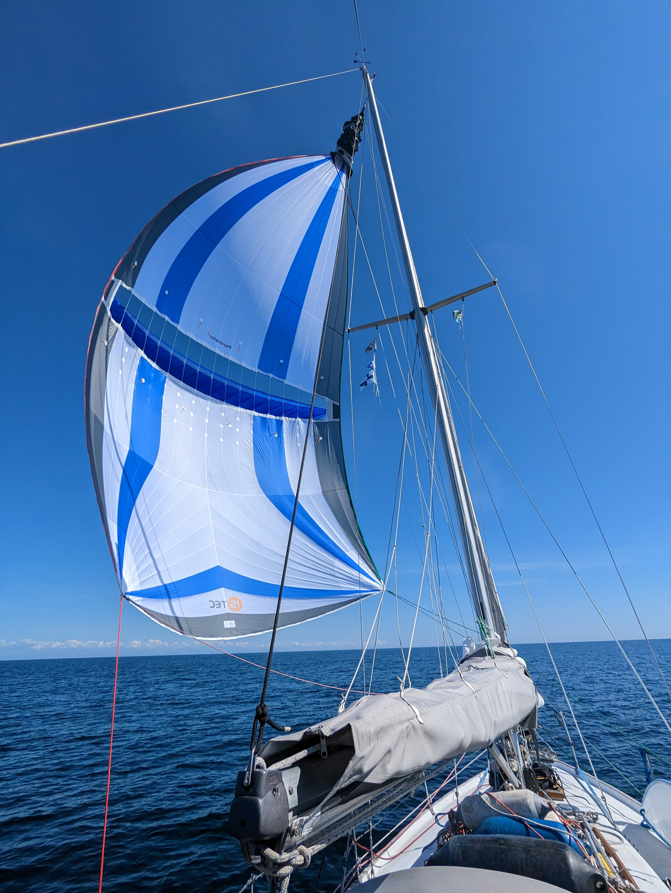
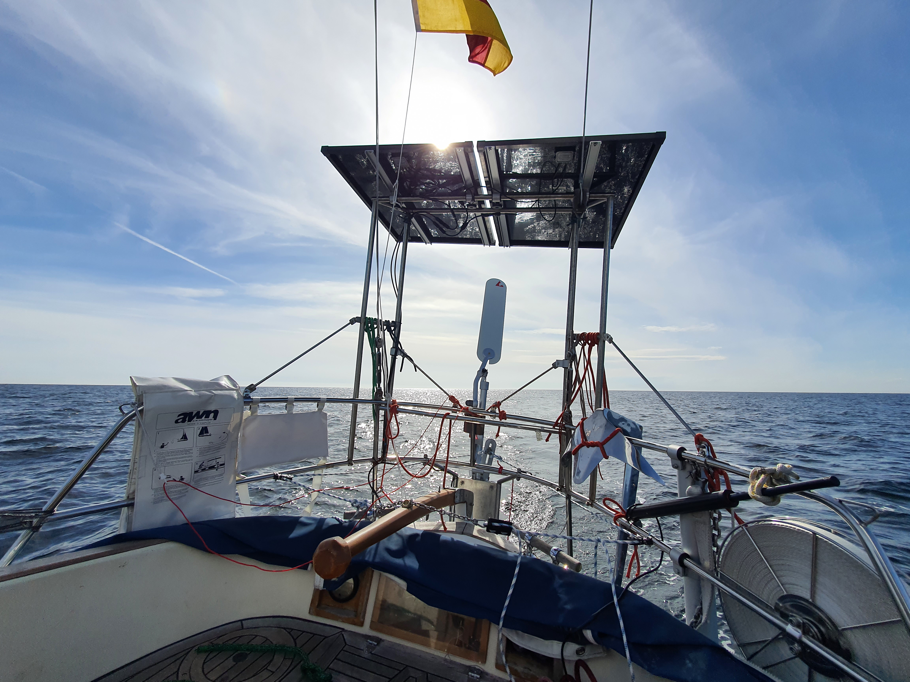
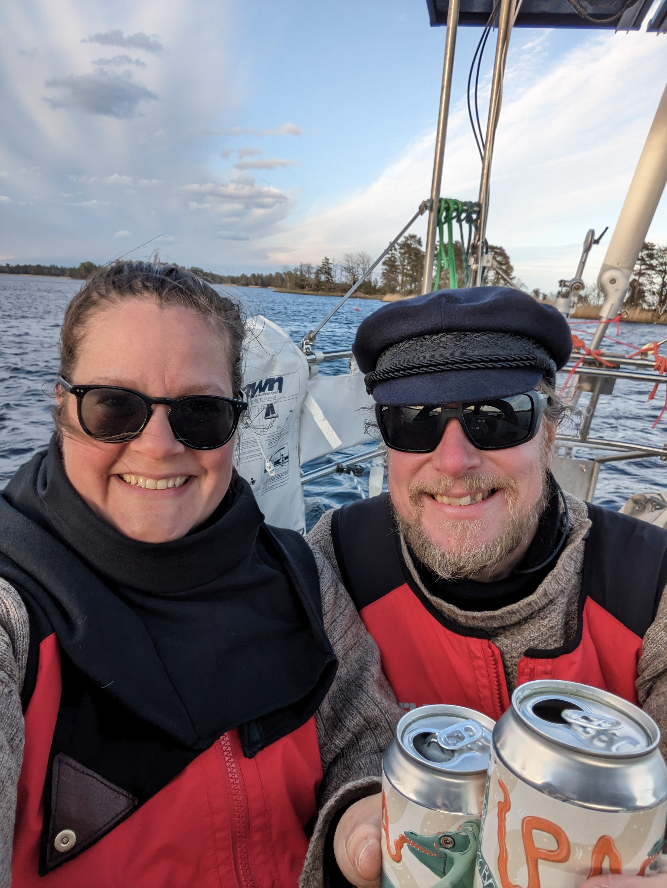

Long weekend was about to begin, and so it was time to sail onwards. Looking at the weather, this meant an early start if we wanted to cross the Bay of Hanö before winds turned easterly.

We checked various anchorages and SXK buoys on the north end of the bay, and laid course for the easternmost one. Weather routing agreed that this would be doable within daylight hours as long as we started before 7am. So 6:30 we were motoring out of the Simrishamn wave break.

Light wind and almost no swell was ideal conditions for the Parasailor, though quite slow going.

 

Around 1pm the wind had turned to the beam, and we switched to the regular main and genoa. The slight increase in apparent wind made it possible to steer with the windvane, and to get a bit more drive we added the staysail to the mix, cutter-style.

After lunch it was clear that we wouldn't make it across the bay in daylight with the light winds. So we changed our plan accordingly, deciding to sail overnight and see how far we'd feel like going in the Kalmar straits.

 

The night was cold but peaceful. No traffic, and the only point of interest was passing the scenic Utklippan lighthouse.

In the sunny morning the wind died, and we had to motor for a while. Once it picked up again, we were able to make way under the poled out genoa and mainsail.
Since the fairway was narrowing towards the city of Kalmar, we decided to continue on the electronic autopilot.

As we passed the Öland bridge, wind picked up significantly. We went from 10-ish knots to 20kt.
It was time to reef. Genoa was replaced with the staysail.
We picked a (we hoped) protected SXK buoy along the Kalmarsund and headed for that. Just as we turned into the Pataholmen fairway, the wind shifted 90° and increased to 33kt. We were pretty happy to have reefed!

After some tricky navigation between the rocks, we're now tied to the SXK buoy here at Pataholmen. Scenic spot, though not with perfect wind shelter. Time for the well-earned "anleger", this time sponsored by Richy and Christian. Thanks!

 

* Distance today: 128NM
* Total distance: 423.5NM
* Engine hours: 4.7
* Lunch 1: chanterelle risotto
* Lunch 2: tofu curry with rice
