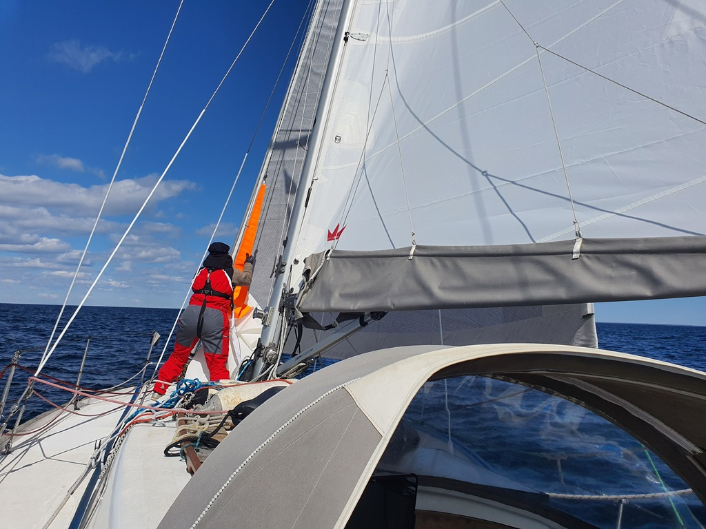
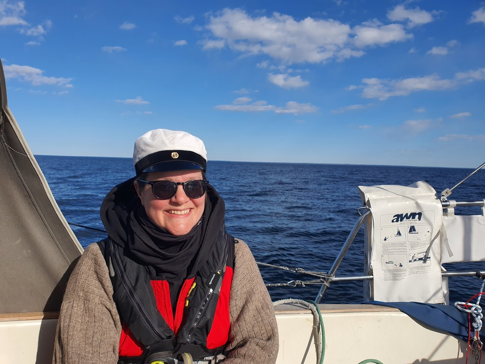
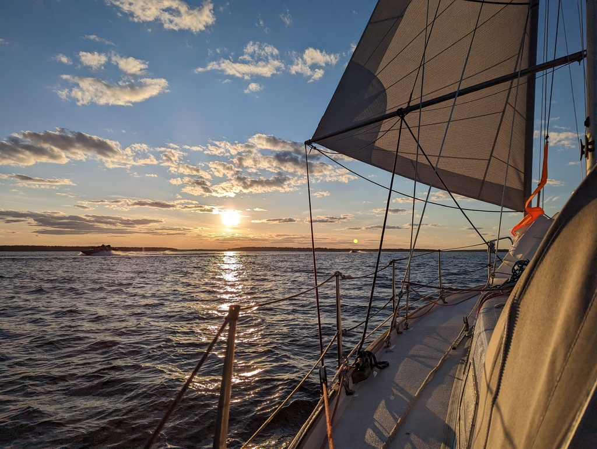

Morning started with pretty strong winds so it was to be staysail and main in 1st reef. We sailed the narrow fairway wing on wing to the main shipping lane, gybed towards north and were on our merry way onwards! During the day the winds calmed down, so the reef was shaken and genoa rolled out.

 

At times the wind was barely pushing us forward and it kept changing direction constantly so Nissinen was our driver for today. 

At 17 local time it was time to celebrate the eve of Vappu and Suski put on her student cap after Manta got hers in Helsinki. _"Klara vappen, dricka vatten, hela natten!"_

 

The most excitement for today we got was during the last hour of sailing. We were sharing the fairway with what totaled up to be over 50 naval vessels, all going very very fast and leaving behind a sizeable wake. We are expecting to see more during the coming days as they are holding a massive military exercise in our current sailing territory. 

 

Now we are again tied to a SXK buoy and enjoying the setting sun.

* Distance today: 46.2NM
* Total distance: 469.7NM
* Engine hours: 0.6
* Lunch: lentil coconut soup
