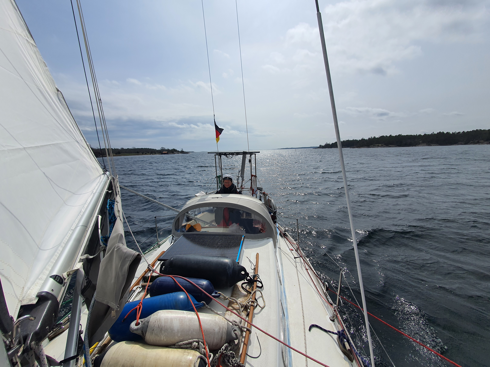
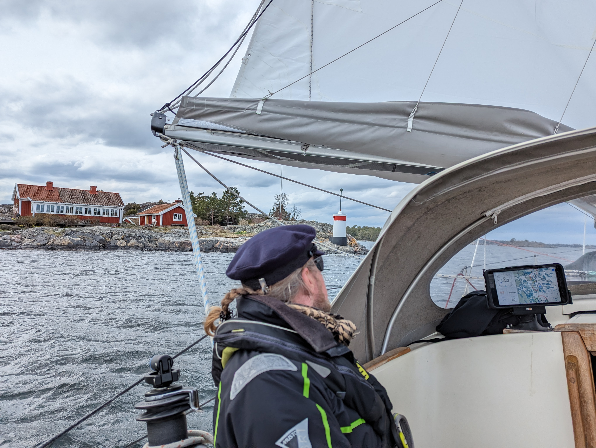

The day started grey and drizzly. But hey, it is Vappu, time to go sailing! Forecast had decent southerly winds for the whole day, suiting our general plan to head north.

At 10am we detached from the buoy and hoisted sail. What followed was a full eight hours of nice fast downwind sailing. Given the very narrow and winding fairway, the numerous gybes gave some exercise, as each time we had to move the spinnaker pole over, etc.

 

Just south of Västervik we were amused by a very American accent on channel 16. _"Charlie 11"_ was talking to _"Freedom 1"_ about having _"many enemies in the area"_. Ok. 🤷‍♂️

In the afternoon the wind picked up quite a bit, making for sporty cooking. The Bolognese turned out excellent, despite some tomato sauce finding its way to the carpet.

Given the fast sailing we were able to run the hydrogenerator the whole day. With that we ended the sail with batteries at 91%, despite the mostly overcast skies.

 

Now we're tied up to a buoy at one the the SXK outer harbours. Lots of buoys and a pier one could tie up to. Apparently in the summer there are also some services here.

* Distance today: 38.8NM
* Total distance: 508.5NM
* Engine hours: 0.4
* Lunch: spaghetti bolognese
