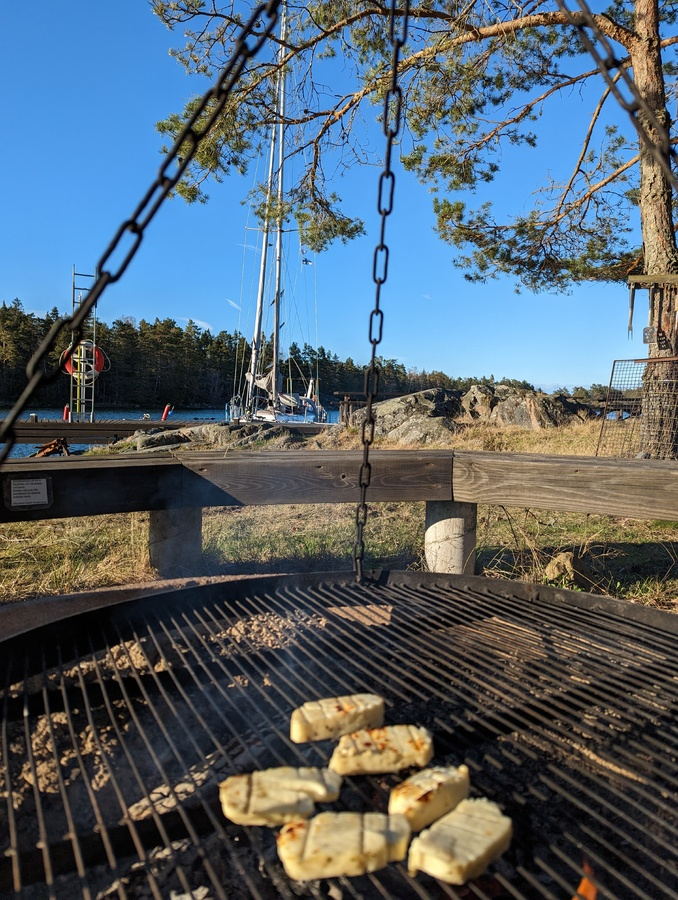

Today's project was to comission our new-to-us watermaker, Katadyn PowerSurvivor 40E. We ate a hearty breakfast as the expectation was multiple leaks and other plumbing issues. Bergie set to work on the watermaker as Suski had a work day. 

To our surprise the watermaker just needed to be turned on and it worked without any issues from the first minute. After running it for a bit we tested the water quality (excellent) and did a tasting 
(tasty). 

 

So we proceeded to start filling one of our jerry cans. After an hour we heard a engine outside, Bergie took a peek and saw the Swedish coastguard. We switched off the watermaker immediately as in the shallow waters of the bay the coast guard vessel had turned the clear blue water to a muddy puddle.

 

It seems that May the second is officially the "inspect Lille Ø day" as also last year we got a visit on the same day. After the few questions coast guard were on their way (after profusely apologizing disturbing our watermaking). We decided to relocate to the SXK pier instead of the buoy as we wanted to prepare our evening dinner on the fire.

 

* Distance today: 0.17NM
* Distance total: 508.7NM
* Engine hours: 0.2
* Lunch today: Grilled halloumi
