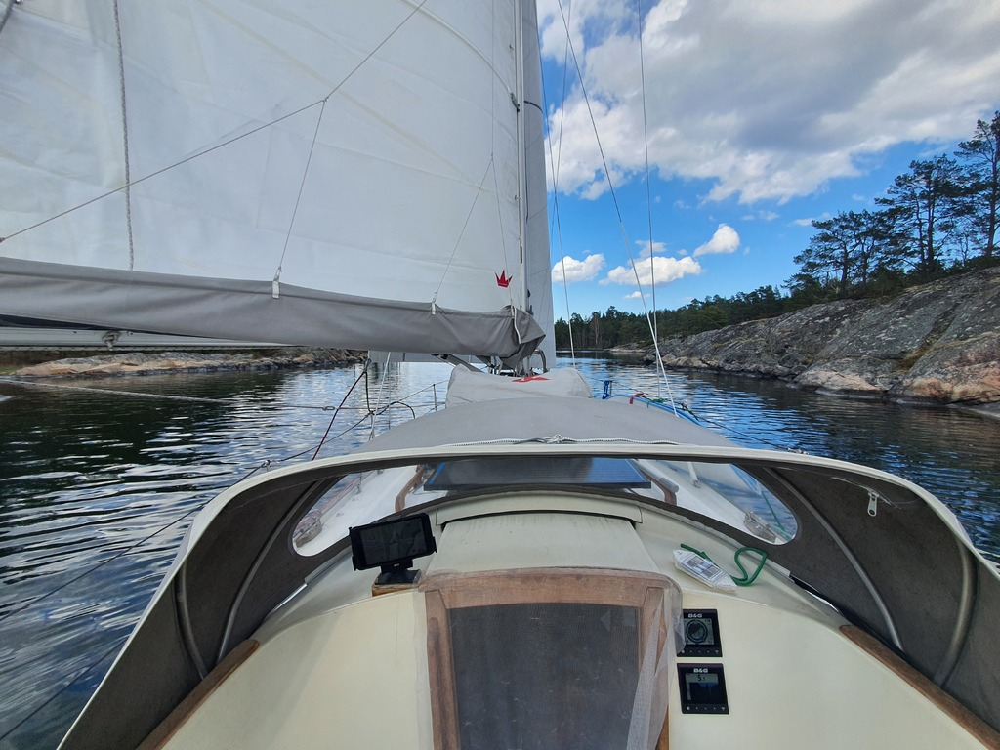

Due to a workday full of meetings we decided to spend the day at the pier. This gave opportunities for charging up our battery bank with solar and making some more water.

In the afternoon we started a leisurely downwind sail through the extremely narrow fairway north. Very scenic archipelago views drifted by, accentuated by occasional warships and their big wake.

 

As the wind started dying, we chose an anchorage on the north end of Håskö. This should protect us from the evening's heavier forecasted easterly gusts. The anchorage is very narrow, with high cliffs on both sides. Would likely allow even side tying. But as winds from all directions are in the evening's forecast, we decided to swing on the bow anchor.

* Distance today: 11.9NM
* Total distance: 529.6NM
* Engine hours: 0.5
* Lunch: Miisa's couscous salad
