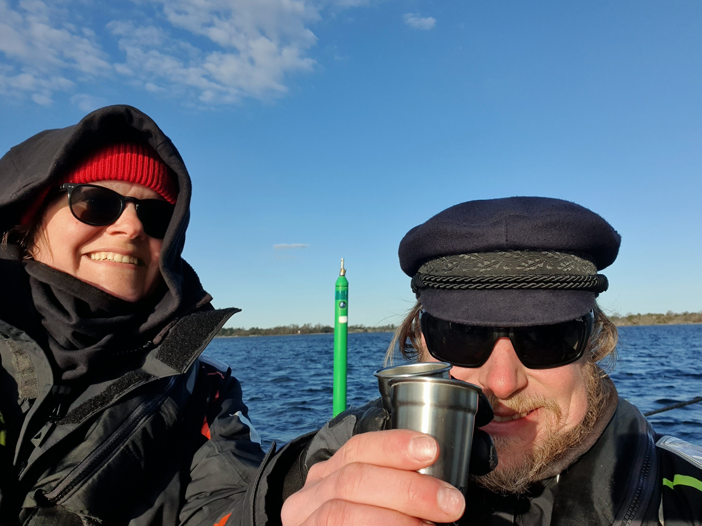

Our secure anchorage held us till after work. During the day it was time to work, bake some bread and make water. After the laptop was closed it was time to head out again. 

The easterly wind was perfect for us today and we were gliding along with a 6kt beam reach. This is as good as it can get! Along our today's route we had "Kejsaren". We greeted the fairway marker as tradition dictates. Skål! 

 

At Arkösund we picked a SXK buoy, which with this wind direction is not the most protected, but the winds should die down for the night promising a good night's sleep.

* Distance today: 15.1NM
* Total distance: 544.7
* Engine hours: 0.5
* Lunch: pea soup
