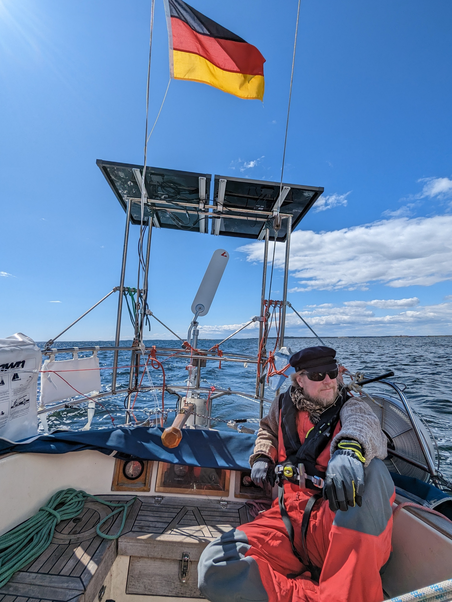
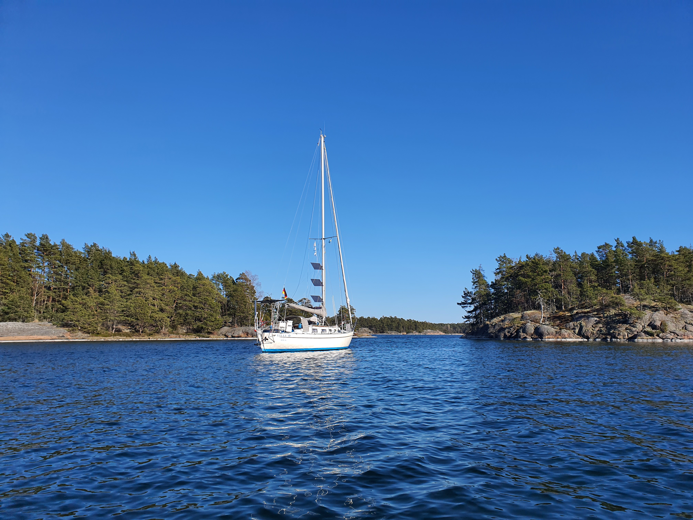

Another beautiful sailing day! Since we knew wind would fill only a bit later, we started the day with a refreshing deck shower - spring hasn't quite yet arrived here, and it was 1°C in the morning. After that, sails up and under way.

 

We crossed the open water part before Oxelösund on a swift beam reach, with our WindPilot steering silently and effortlessly. Almost no need to touch the sheets during the trip.

We arrived the the by now familiar protected bay of Äspskärsfladan and picked one of the SXK buoys. This is part of the Stendörren nature park, and we intend to explore the bays and trails here for the weekend.

 

* Distance today: 23.2NM
* Total distance: 567.9NM
* Engine hours: 0.5
* Lunch: cheese and vegetable wraps
