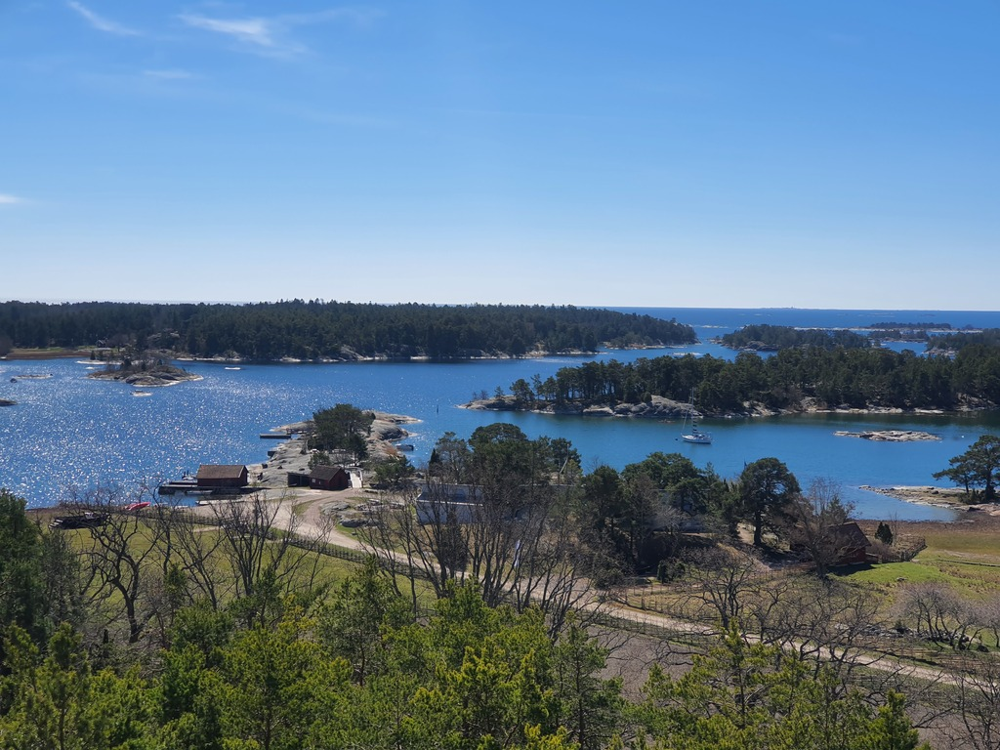

Today we took the mammoth task of changing to another SXK buoy 1 nautical mile away! We side tied the banana boat to Lille Ø and turned on the motor. Then we proceeded to slowly motor through the narrow passes between rocks, both visible and hiding just under the surface. 

 

The entrance to Stendörren buoy is what you can call questionable at best. With a slow pace trusting the map and the depth sounder we glided in and caught the buoy. We had perfect timing as half an hour later a hopeful Swedish sailboat came by only to figure out that the buoy was already taken. From now on I expected that we will find it ever harder to find the SXK buoys free as the locals are slowly realizing that it is sailing season!

 

* Distance today: 1NM
* Total distance: 568.9NM
* Engine hours: 0.5
* Lunch: feta spinach quiche
