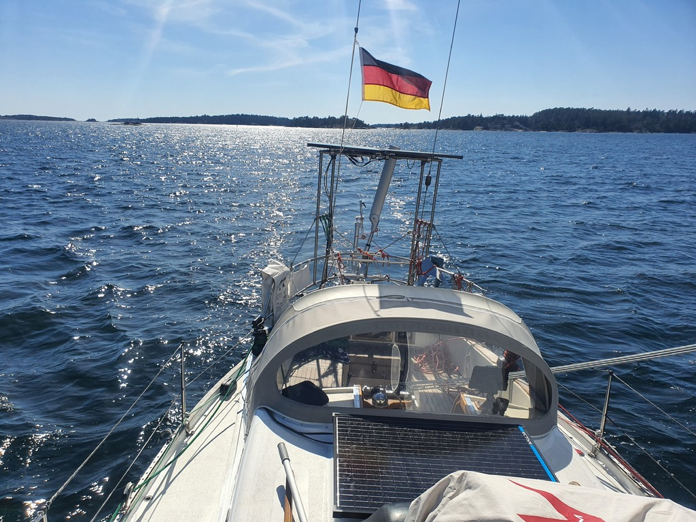

Another sunny day. It is hard to believe that we've been off-grid for two weeks - batteries are full, as is the freshwater tank. Time to head west for our weekend plan!

 

We started the day with full sails, but approaching the narrow Sävö straight, the wind started picking up. To keep the office worked below happy, the 22kt gusts meant going to first reef and rolling in some of the genoa.

The slowly warming weather is starting to wake up the local boaters. Today was the first day in Sweden when we saw more civilian than military vessels under way. We even got passed by a large Finnish sailboat!
 

We're now tied to the SXK buoy at Ankarudden. Pretty but rolly, just like last year.

* Distance today: 15.6NM
* Total distance: 584.5
* Engine hours: 0.3
* Lunch: spaghetti with avocado sauce
