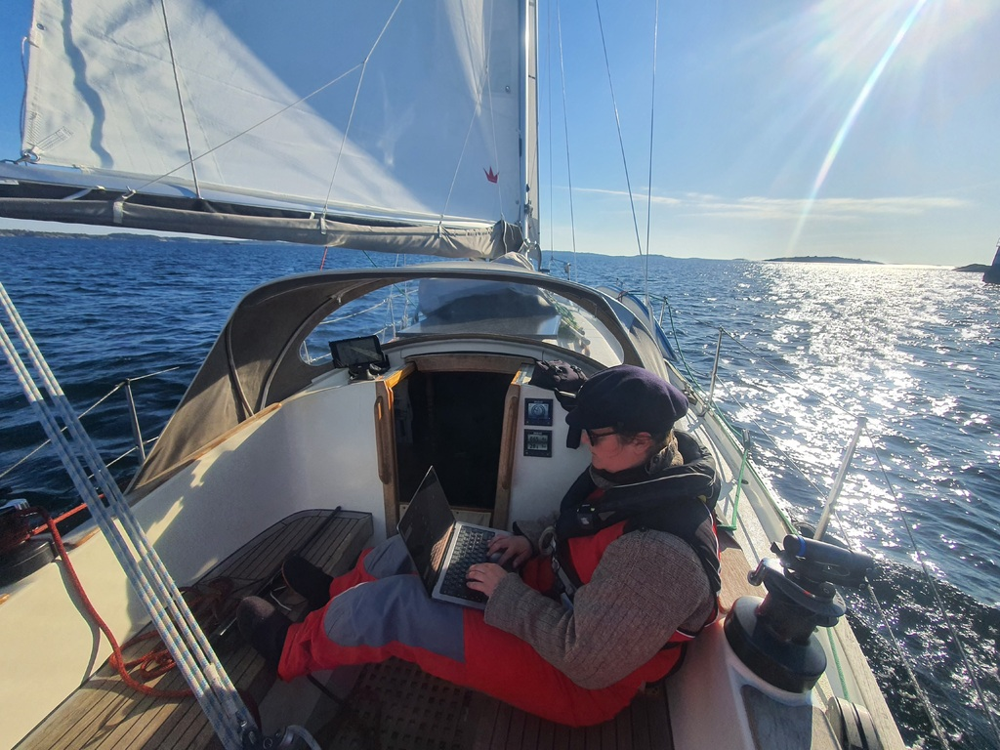
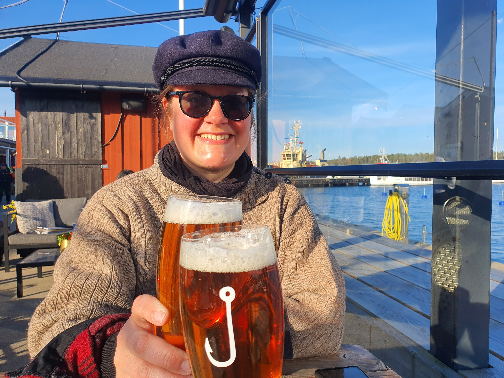

Weather dictates when we wake up and when we set sail. We are expecting a gale coming in this evening, so we left early in the morning to sail the last 10 NM to Nynäshamn. We hoisted the main sail when still tied to the buoy and sailed away, motor running on neutral, just in case. With a 60° wind angle we then rolled out the genoa and left the anchorage in style.

 

In two hours we were already moored in Nynäshamn.  It is time to wash _all_ the laundry. Also finally we have reached the territory where every marina has a sauna! The adventure continues next week when we start exploring the Stockholm archipelago.

Todays "anleger" is sponsored by Thilo! Kippis! 

 

* Distance today: 9.6NM
* Total distance: 594.1NM
* Engine hours: 0.3
* Lunch: smoked salmon and toasted rye bread
