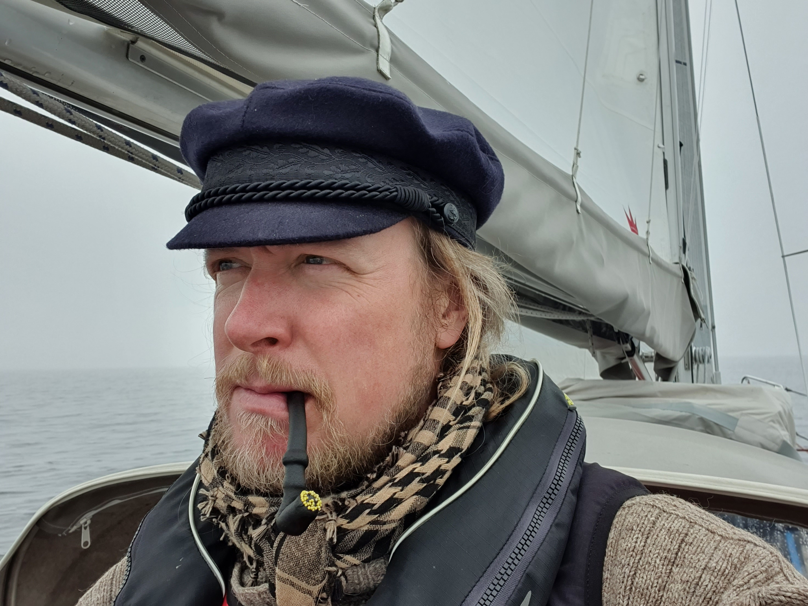
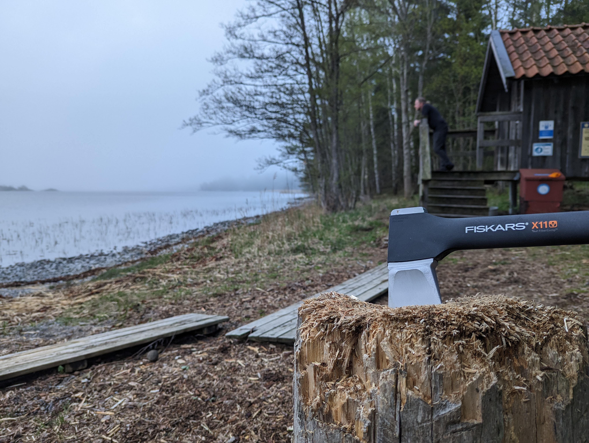

We started the day with a trip to the local gas station. The spring has been cold, and hence we've used quite a bit of diesel for heating. After filling up, under way!

Today was very stop-and-go kind of day. A low pressure system went over us, bringing rain, fog, sunshine, wind, and calms, all multiple times and with varying intervals. At times we were beating into a nice 12kt wind, then half hour later motoring in a total calm.

 

But we made it! We're now Scandinavian moored in a bay at Nämdö, next to the open sauna maintained by the Stockholm archipelago foundation. A nice sauna and swim session followed.

 

We hope the island shelters us from the brunt of tomorrow's gale when the "non-navigable sector" of the low pressure system passes over us.

* Distance today: 35.6NM
* Total distance: 629.7NM
* Engine hours: 3.8
* Lunch: feta oven pasta
