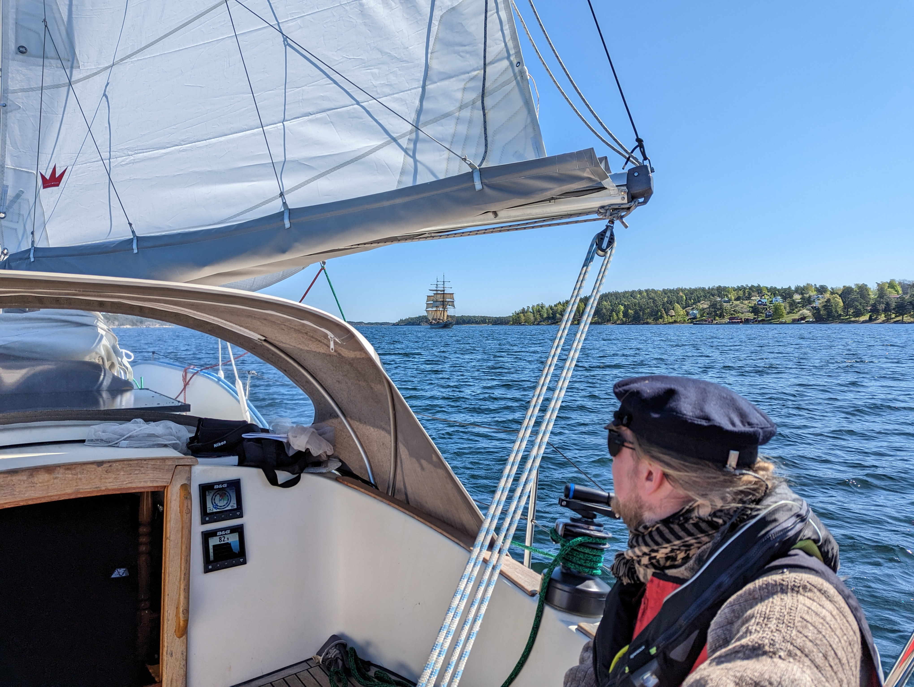
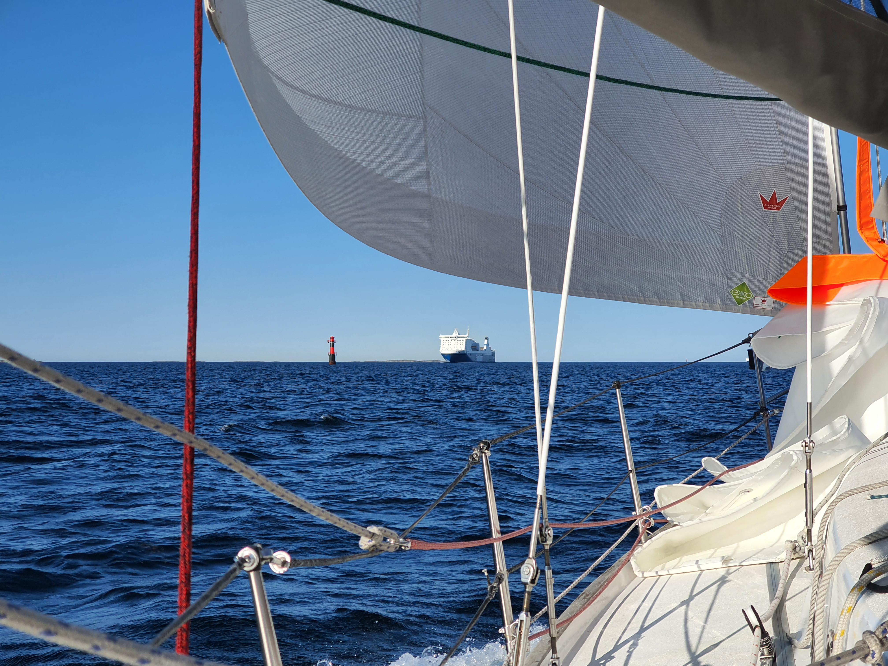

A long weekend and a promising forecast meant heading out a bit further. Refreshed by sauna and the good sleep, we prepared the boat and left the SXK pier.

 

Right outside the harbour we were greeted by a beautiful sight - brig Tre Kronor was exiting another channel and setting up their sails. We passed them and continued our way north.

After lunch we started the six-on-six-off watch system, following the Stockholm archipelago's winding fairways to get eventually offshore. Here we could sail more safely overnight and let the windvane do the steering. Höga Kusten, here we come!

 

* Distance today: 39NM
* Total distance: 674.2NM
* Lunch: pea soup
* Engine hours: 0.2
