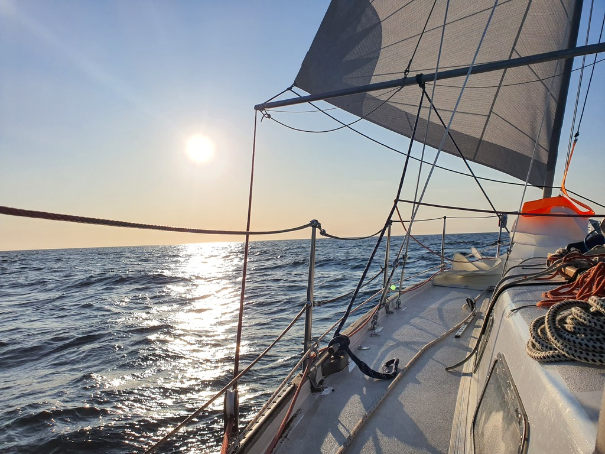

A full day offshore started with light winds where we had to steer by the electric autopilot. This sea area is really quiet! We've only seen a few cargo ships and maybe a dozen seagulls all day.

 

Today's highlight was the first noon sight practice on our loaner sextant (thanks Wilfried!). We ended up 7NM from the GPS position. Good enough for many landfalls, but maybe not for avoiding reefs.

In the afternoon watch the wind filled in and we were able to steer on the windvane again. The hydrogenerator assisted in producing power and we made some water.

 

We expect to sight Höga Kusten sometime in the early morning hours. Nights are getting really short up here, with only hour or two of slightly darker dusk.

* Distance today: 98NM
* Total distance: 772.2NM
* Lunch: cheese and vegetable wraps with homemade yoghurt
* Engine hours: 0
