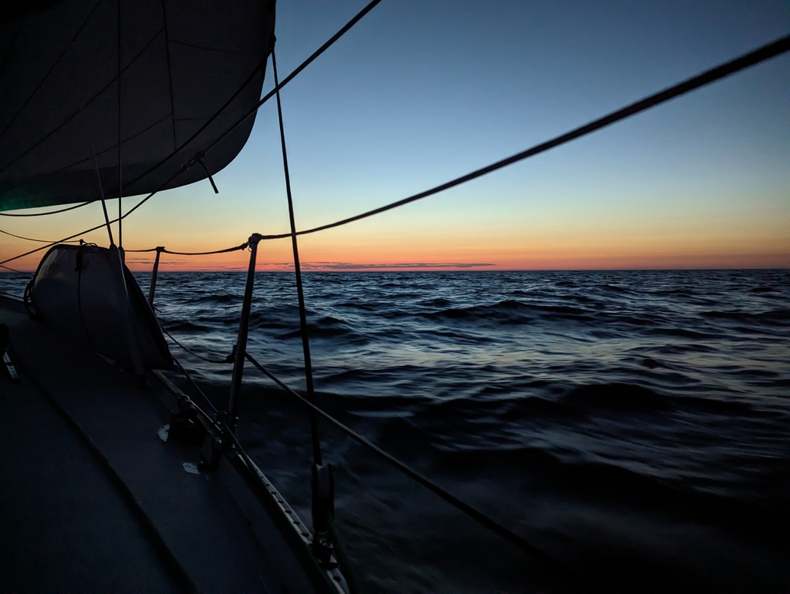

The night brought with it a little bit more wind and we were gliding on the waves smoothly. The northen horizon glows with sun's rays and it is just pure magic to do night passages this time of the year. Dusk and dawn simultaneously on the northern side and stars and night sky on southern side. 

 

We got Starbuck, our windvane, dialed in so smoothly that all we needed to do, was to keep lookout and ourselves warm. Entertainment for the night was provided by Turku Radio informing regularily the channels where you can get info on the locations of the ice breakers (!!!) and weather. With the sun warming us during the days and the vibrant green leaves it is easy to forget that Bay of Bothnia is still partially covered with ice!

We caught a SXK buoy in Juniskär and get to enjoy sunshine and the first T-shirt weather day (at least as long as the sun is up).

* Distance today: 69 NM
* Total distance: 841.2 NM
* Lunch today: feta salad
* Engine hours: 0.1
