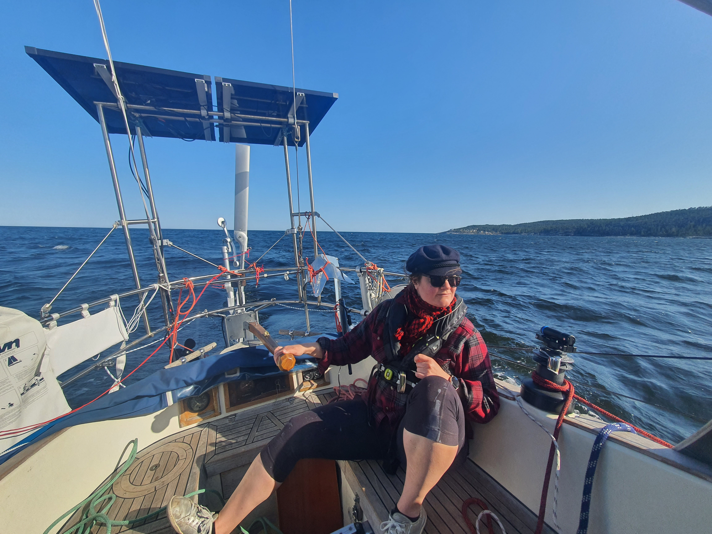
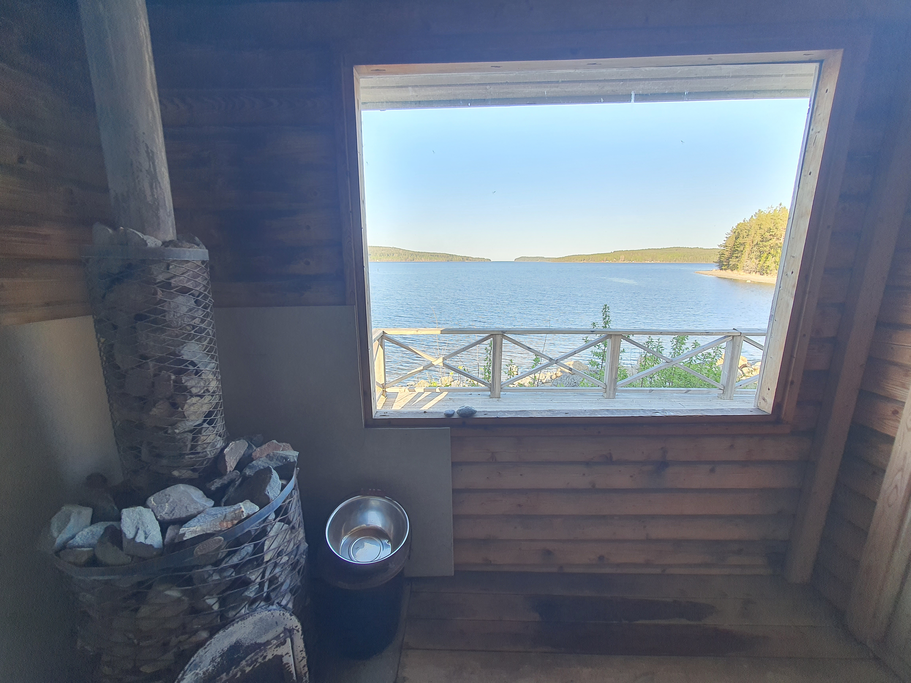

While the passage from Stockholm archipelago to Sundsvall had been lovely, today's sail was more on the frustrating end.

Forecast had a steady force 4 from southeast, which sounded awesome given that we were going northeast. What was the reality was basically a day without wind, apart from a couple of local high wind zones. And when combined with the 1-2m swell offshore, that made for quite bumpy going. It was interesting to cook a proper meal with the stove hitting each end stop of the gimbal every few seconds!

 

After a few false starts (wind-no wind), we decided to save the sails from the heavy slamming in the waves and motored. When we finally turned into the "protected" channel towards Härnösand, we decided to try sailing again. The wind came back with a vengeance. From 2kt to 27kt in just a few minutes. Luckily we had put in a reef!
Lesson learned: here among the high hills of Höga Kusten, the local wind effects are the thing to look for, not the weather forecast.

 

We tied up to the island base of the local yacht club. For a small fee we can use their facilities, including a very nice wood-heated sauna. Looks like we were quite lucky with our timing - apparently the club only installed the piers earlier today. The bay was still frozen two weeks ago!

* Distance today: 32NM
* Lunch: shiitake and egg fried rice
