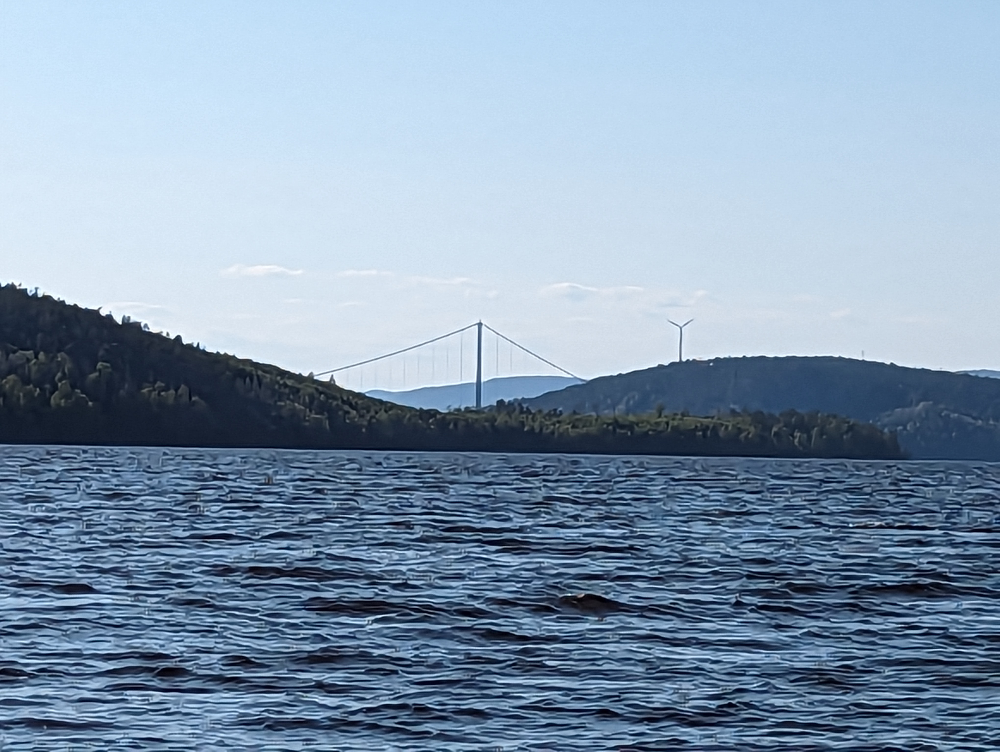
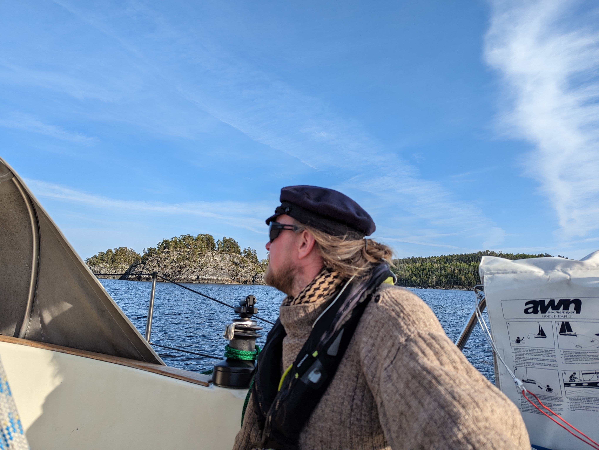
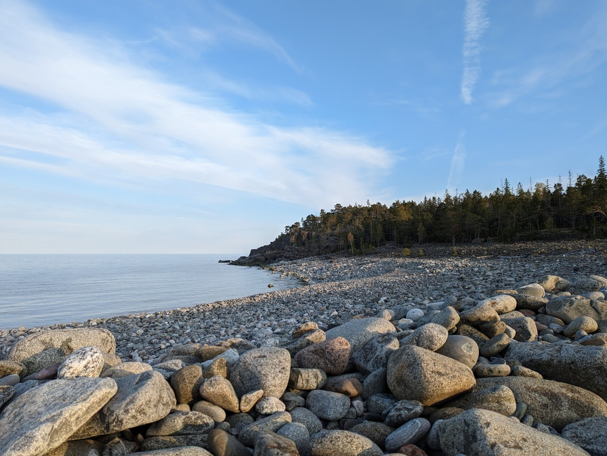
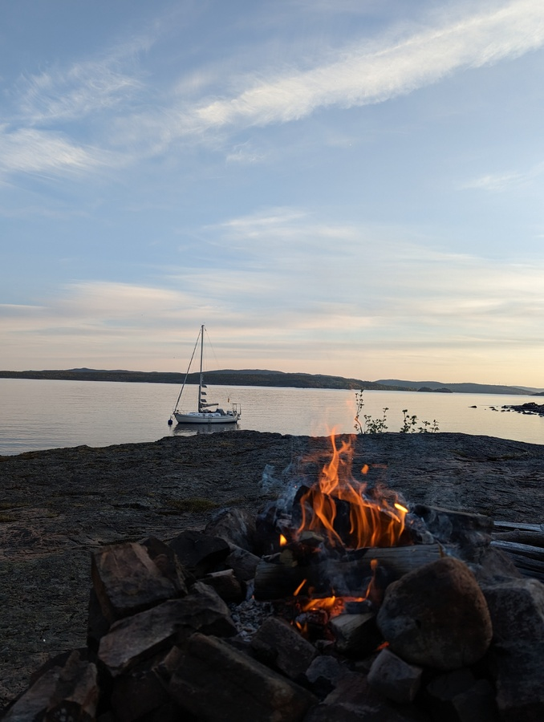

After work it was time to set sail again. We took the inside route as we wanted to see the High Coast Bridge. They call it the Golden Gate of the North. Inside route also ment that you can effectively forget the wind forecast as the high hills create their own wind. From 15kn to 0 and back and everything from beating to broad reach while going to the same compass course. 

 

The high hills make it also impossible to evaluate distances. What at first glance seems like short tacking can be 2 NM and a 15 min stretch. As we approached the SXK buoy at the bay we both were convinced for a while that the buoy must have moved over the winter as it was practically on the beach! Getting closer we saw the depth 50 meters, 30 meters and closer. The buoy sits tightly in 10 meters of water about 50 meters from the shore. 

 

After securing the boat to the buoy we put together the banana-boot and headed to shore. Partially the landscape looks like someone built it in Minecraft, partially it is impassable woods and partially it is what we call "pirunpelto" devil's field. The nature trail took us to the other side of the island where we were greeted with signs that the lake was actually a medieval fishing harbour that needed to be abandoned in 19th century because of rising land closed the secluded bay from the ocean.

 

Now we are sitting on the shore preparing to cook some dinner on the fire.

 

* Distance today: 12.9 NM
* Total distance: 886.1 NM
* Lunch today: Miisas cous cous salad
* Engine hours: 0.6
