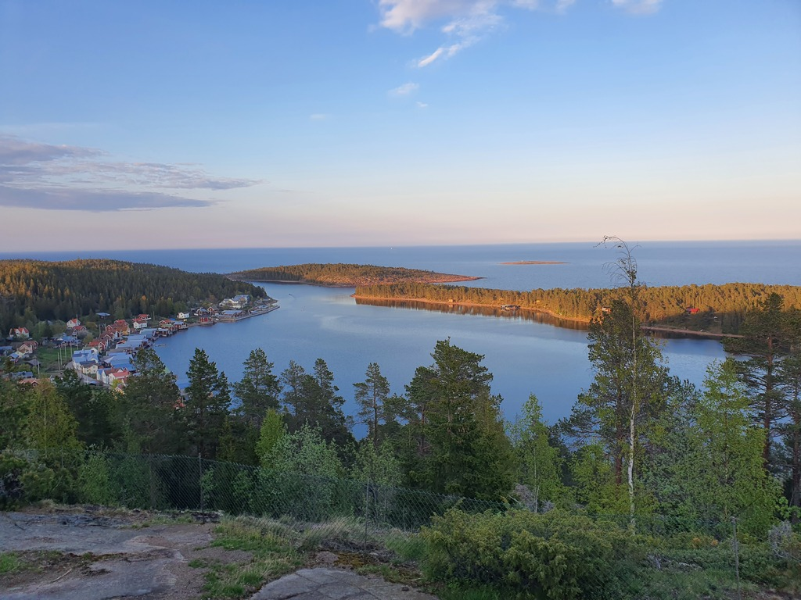

What a lovely day for a spinnaker sail! A south wind started coming up around 11am, so we detached from the buoy and hoisted the Parasailor. Then it was a leisurely glide past the monumental fells of the High Coast, with the Parasailor dampening the waves for the office worker.

 

When we reached our target bay, the local wind started funneling again, and we switched back to white sails when the whitecaps started showing up. Better safe than sorry, though this time the wind remained in manageable quantities.

Our original target was the extremely protected island on Mjältön, but when we arrived there we noticed the piers were still on land and the internet non-existent. This is why we always have backup harbours. We motored the 4NM channel to the nearby Ulvön.

This is quite a lovely old fishing village. After Scandinavian mooring to the town dock we went for a stroll. A bit eerie to not see any humans anywhere, but that place is very pretty. The views from the "pilot hill" were especially nice.

 

* Distance today: 27NM
* Total distance: 913.1NM
* Lunch: chanterelle risotto
* Engine hours: 1.6
