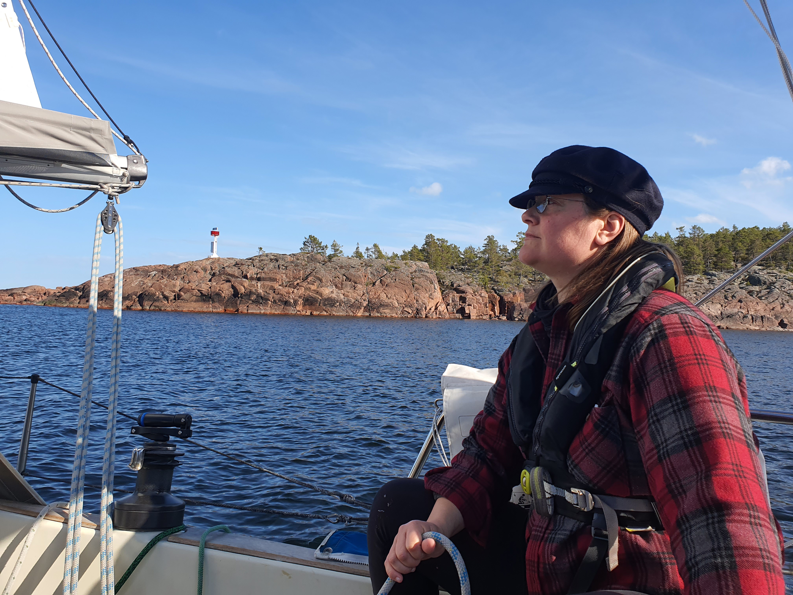
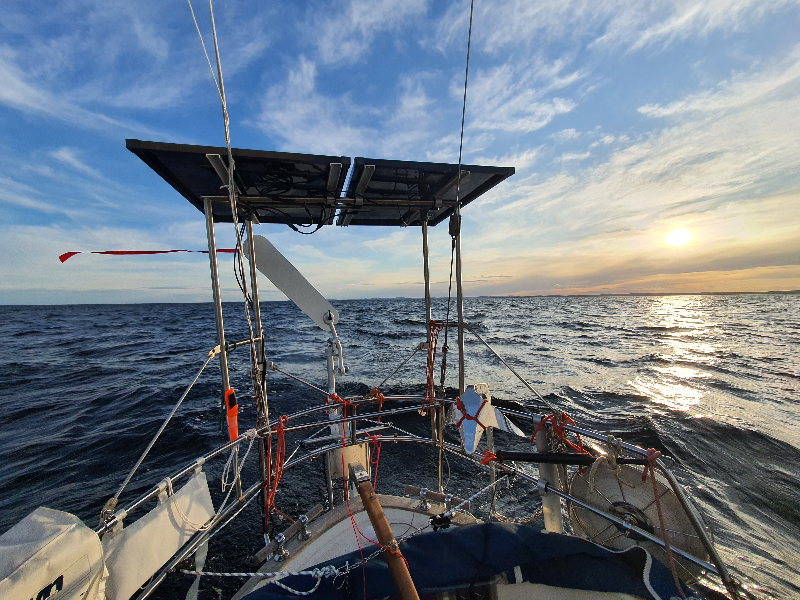

We spent an extra day in Ulvöhamn to wait out a blow. Then, the next day, as work laptop was closed we hoisted anchor and headed out. An _"auf wiedersehen"_ rang from the shore.

 

As we will head more north, the last couple of weeks has been constant monitoring of the ice charts. Now finally the Bay of Bothnia was ice-free enough that the Finnish icebreaker fleet could head to summer quarters. This means we could continue sailing! Convenient, given that this is another long weekend.

 

We're now following the Swedish coastline - some four-ish miles offshore - on a broad reach with the windvane steering. The sun is already low in the horizon, and the next watch change is at midnight. Soon we'll enter the Kvarken area. 

Happy Towel Day, everybody!

* Distance today: 22NM
* Total distance: 935.1NM
* Engine hours: 0.2
* Lunch: pea soup
