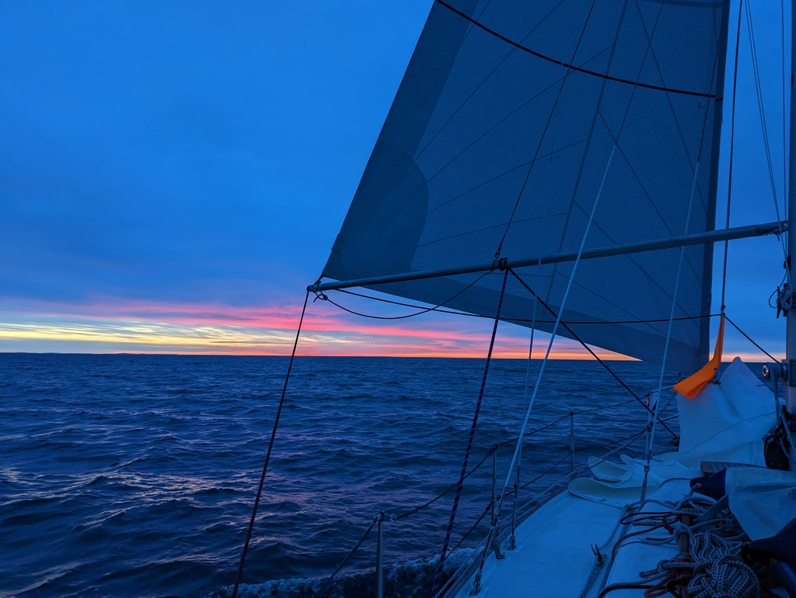
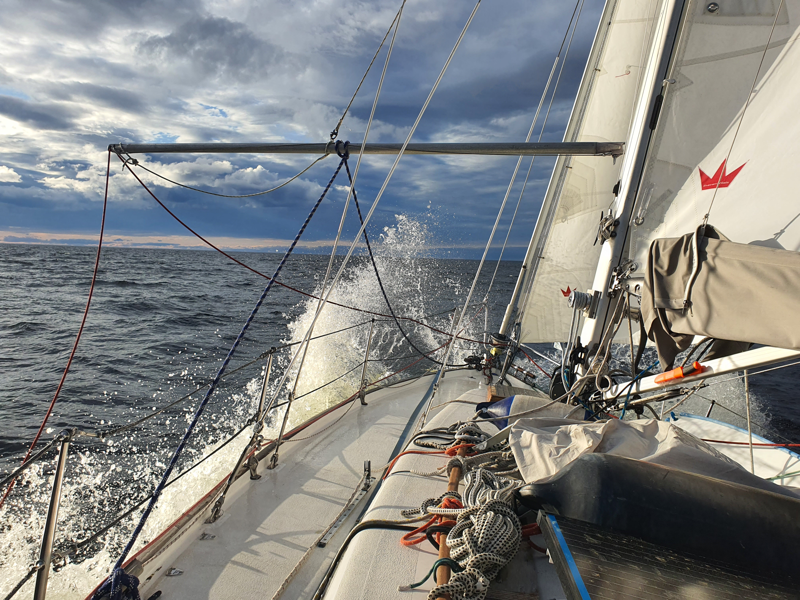

Now that we're above 34°N, it doesn't really get dark at all. The sun sets around 11pm, there are a few hours of dusk, and by 2am it is rising again.

 

We've been on a beam reach since morning. Changing wind conditions have meant using the full main and genoa, and occasionally the staysail with main in the first reef. As I write this, we're sailing with both headsails and full main to power through some opposing waves.

 

These passages have their own rhythm. Six hours of rest, then six hours of sailing alone, listening to podcasts and keeping watch. We have the meals together, but otherwise it is very much single-handed sailing, done serially.

As on the previous days, this sea is very quiet. A bit of shipping that politely make way for us, some seagulls, and not much else. Now the landscape is also flatter as we left the High Coast behind.

* Distance today: 113NM
* Total distance: 1048.1NM
* Engine hours: 0
* Lunch: feta avocado salad
