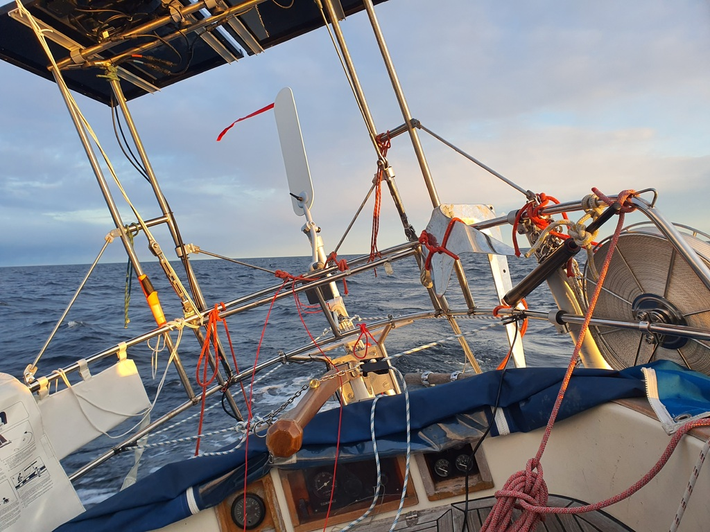
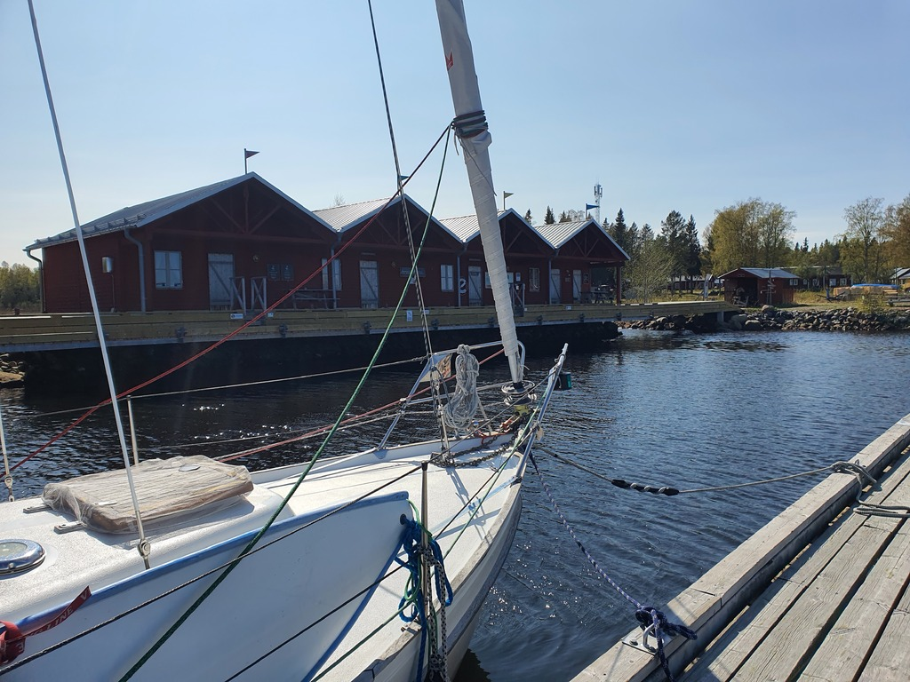

The second night was a fast one. Double foresails and full main meant that we were proceeding with hull speed. Our hydrogenerator kept our battery full, even when the off-watch was using the electric blanket to thaw themselves out after watch duty outside.

 

 The difference in the amount of light between the two nights is astounding. Only about 89NM to the Arctic Circle! This photo was taken on the darkest hour of the night, 2 hours after sunset and 2 hours before sunrise.

 

Junkön harbour is tiny but cute. There is some small scale fishing industry still left. You know you are coming in early when you get to say good morning to the fishermen when they are going out. For us this means breakfast, a bit of sleep and exploring the island while waiting for a gale to roll over us in the early hours of Sunday.

  

While we're in sub-arctic waters of southern Lapland and it is still quite cold outside, one of the benefits of cruising here is that every harbour has a sauna. Time to sample the one here and enjoy the howling wind from a warm place.

* Distance today: 32NM
* Total distance: 1080.1NM
* Engine hours: 0.4
* Lunch: spaghetti with avocado sauce
