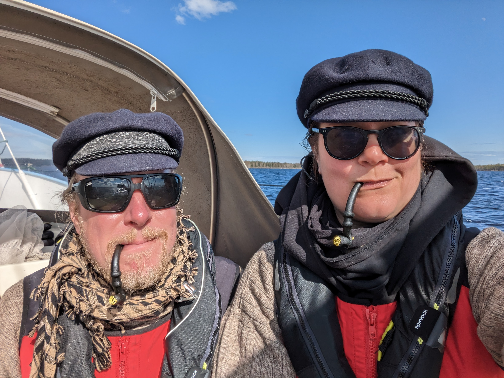
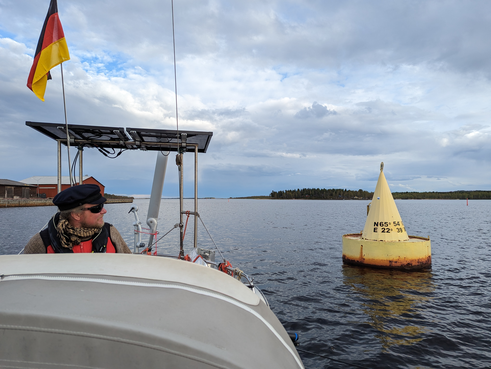

The gale blew past without incident, and we happily slept late. After a late breakfast we turned the boat around in the narrow harbour with lines. Then out and towards North.

 

Today's sail was a pretty mellow one. We gybed down a narrow and winding fairway with a reefed main. Extra excitement was provided by quite a few missing fairway buoys - the ice left only a week ago, and they haven't had a chance to fix them yet.

Eventually we reached our target, the yellow buoy that marks the northernmost navigable point of the Baltic Sea. We sailed around the buoy and tied up to the marina next to it. Then we got invited for dinner and drinks aboard the only other sailboat present, a German Scampi out of Kiel. Buoy party FTW!

* Distance today: 31.2NM
* Total distance: 1111.3NM
* Engine hours: 0.5
* Lunch: lentil coconut curry
