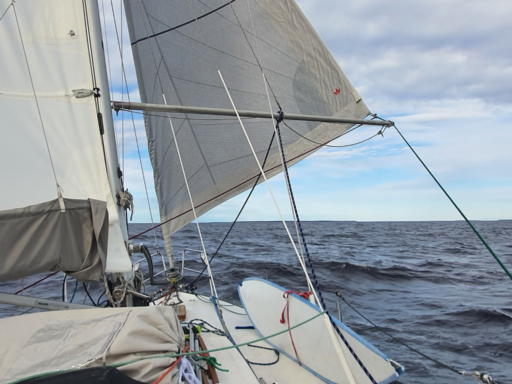

After some well deserved sleep, we took off at noon. As the night is light, we can arrive to the destination at any given hour without an issue. We raised the mainsail just outside the harbour and were on our way towards south, for the first time on this trip! 

The strong wind on beam gave us a reasonably quick  sail, with average speed of 5.1 kn! When we reached the offshore portion of the trip we reefed the sails without losing any boat speed. Bigger sail area doesn't always translate to speed. The closer we got to Haparandahamn we saw from the place names that we already had crossed the language boundary. Most islands here have a Finnish name.

 

As is the tradition, we got a nice maneuver gust, so we moored to the fisher pier, as we saw that all the fishing boats are still on land. Whether we can stay there or not will be discussed with the harbourmaster when he comes back tomorrow morning. 

We found also the Gothia club flag left by Manfred.

 

* Distance today: 42.9NM
