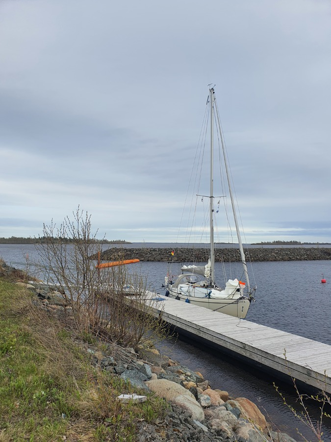

Having done the obligatory Haparanda traditions, it was time to press on. Wind made the harbour departure a bit tricky, but the schoolbook manoeuvre of driving into a front spring did the trick.

Once we got out, the wind proved to be stronger than forecasted, and we were blasting along close to hull speed with only the reefed main. Once the fairway turned a bit more windward, we added the staysail to give a bit more drive through the waves.

 

We crossed the border on a beam reach, and hoisted up the new courtesy flag. Then we approached the northernmost marina in Finland, just east of the Tornio industrial area.

The harbour master hasn't been picking up the phone, and so we tied to the first pier. Later we chatted with a local boater. We're the first visiting boat of the year, and can stay in the place without issues. "The owner puts his boat into the water only at midsummer".

 

* Distance today: 13.3NM
* Total distance: 1167.5NM
* Engine hours: 1
* Lunch: potato pecorino bracioles
