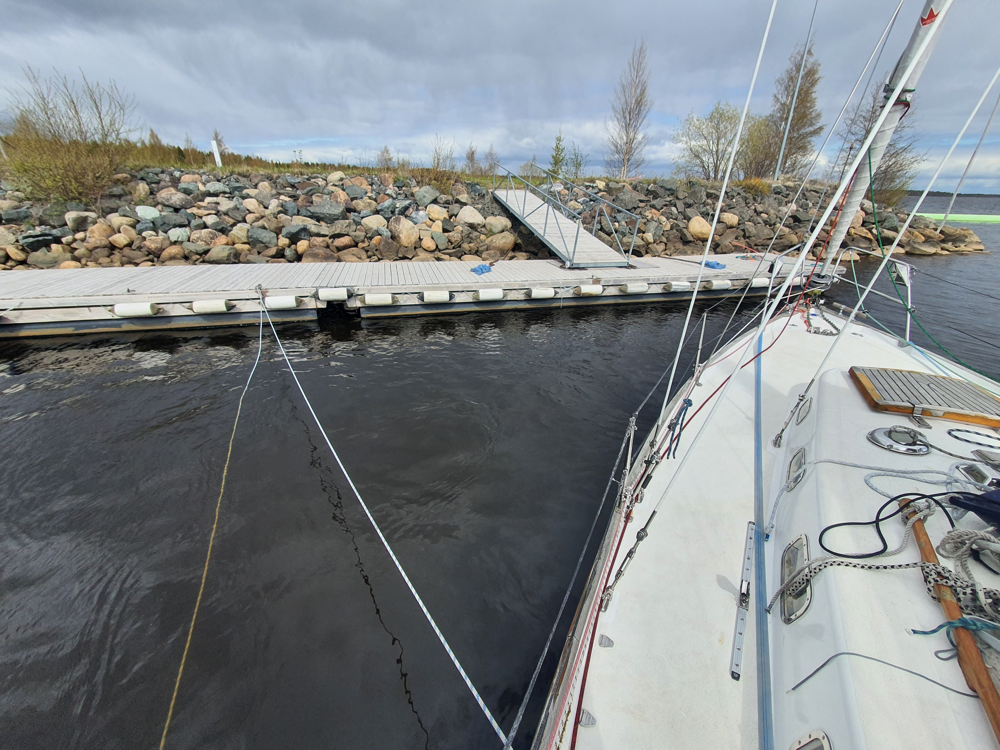
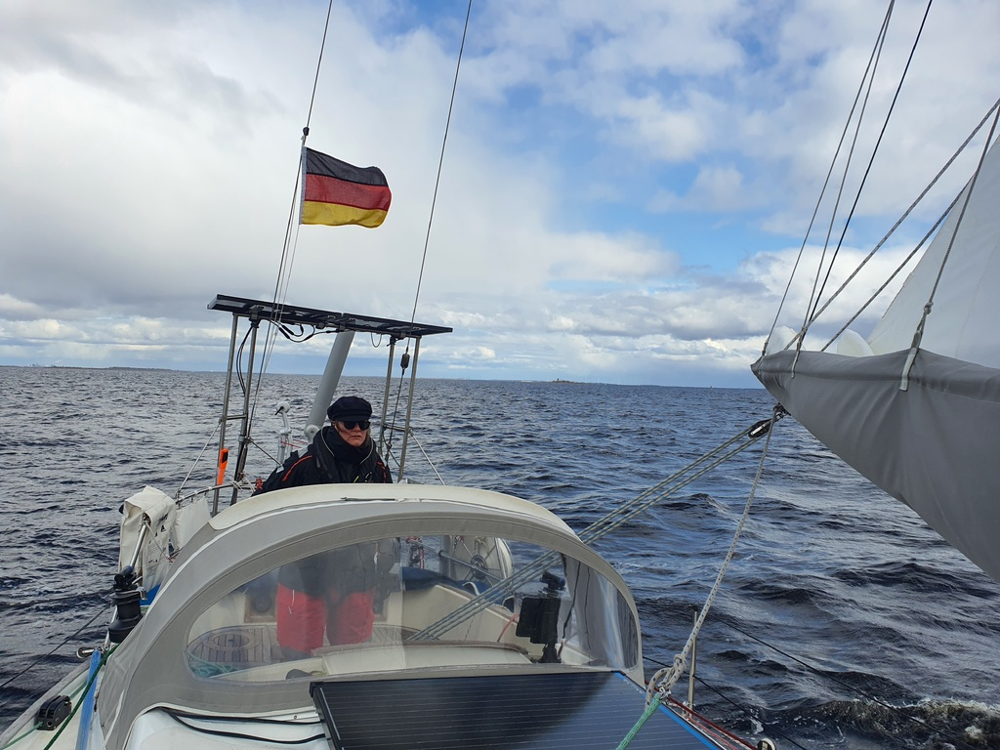
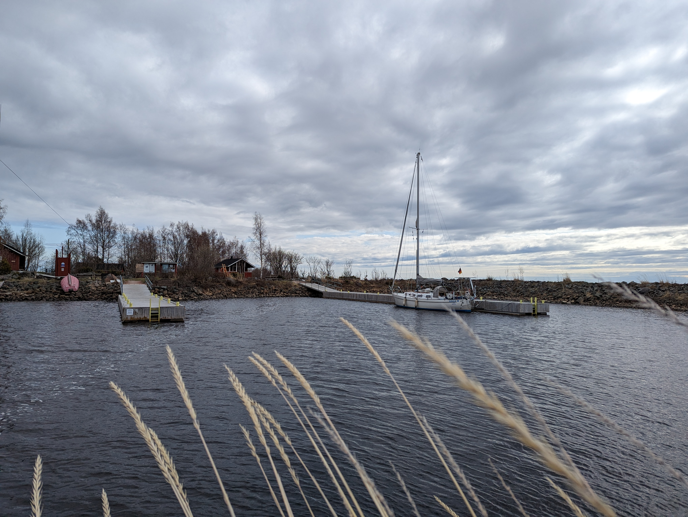

Our stay in Koivuluodonletto was extremely nice. Both the Tornio municipality employees and the members of the local yacht club were helpful and kind. We had the honour of being the first visitors of the season! We spent a couple of days waiting out a series of gales.

Today the wind is prognosed to die down significantly, so a longer passage was out of the question. I have no need to deliberately put me on high seas and low winds. As a destination we chose Selkä-Sarvi, a island that is part of the Bay of Bothnia National Park. Before arriving we called the area's nature center to ask whether or not the piers were in place. The answer was a slightly perplexed person saying "yes, they should be fine. So you are going today?!? The ice is gone since a week only" 

Leaving the harbour was carefully planned. We consulted the "Harbour manouver handbook" and chose to let the wind do most of the work for us. We tied a long line from the port side mid cleat to the pier and back to port side winch. As we were side tied on the starboard side and the wind was blowing from the same direction we just removed all other lined and let the boat swing to 90° angle from the pier, and then did the last bits of the turn with pulling from the rope, when we had enough distance to the pier and our nose pointing out of the harbour it was easy to motor off!

 

The way here was protected by islands and rocks, so the waves were of a reasonable size. The wind was gusty, base at around 10kn and gusts up to 30kn.  We had the main on 1st reef and we kept rolling a tiny sliver of genoa in and out depending whether we saw a squall coming out way or not.

 

On arrival, we of course got one of the high wind patches, so we chose the first pier, which gets some of the swell from outside. We tied in and waited the gust to pass and proceeded to reverse out of the harbour and re-entered to the second pier further in the small harbour.

 

The island has a small nature trail, fire pits, and a sauna. I think these will keep us entertained until the wind comes back.

* Distance today: 11NM
* Total distance: 1178.5NM
* Engine hours: 0.6
* Lunch: spaghetti with tomato sauce
