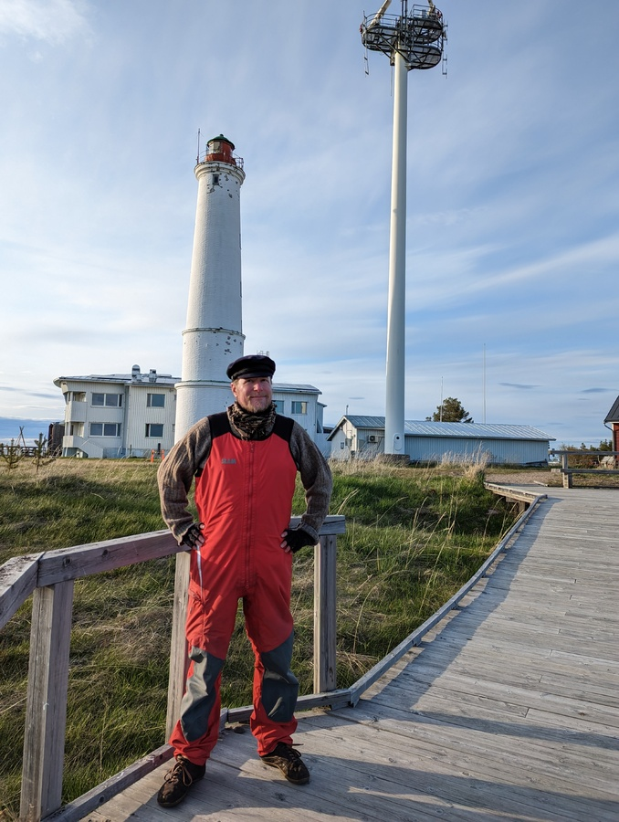

The island of Selkä-Sarvi was a treat. Beautiful nature and great hiking infrastructure. We even got a tour of the gaff-rigged schooner that brings tourists to the island.

 

After a day of southerly winds, the wind finally turned westerly and started picking up, and so we left before noon on a southerly course towards Hailuoto.

Having been sailing in narrow and rocky fairways with high winds, it is easy to forget how relaxed life is offshore. We got the WindPilot tuned in, and sailed onwards for the whole day with an easy, comfortable beam reach.

 

Approaching the island of Hailuoto the winds started picking up, and sea state followed. Here we have been warned of shifting sand banks, and hence tried to our best to follow the zigzagging fairway where most of the buoys were still missing.

As we arrived to the old fishing harbour of Marjaniemi we had planned to pick up a stern buoy. Coming closer, we noticed that the pier didn't yet have shore connection. The only other pier was occupied on the sheltered side, and so we side tied on the windy, wavy side. The friendly motorboaters from the other side agreed to move their boat a bit, and so we were able to move to the sheltered side as well.

 

* Distance today: 42NM
* Total distance: 1120.5NM
* Engine hours: 0.4
* Lunch: cashew curry with rice
