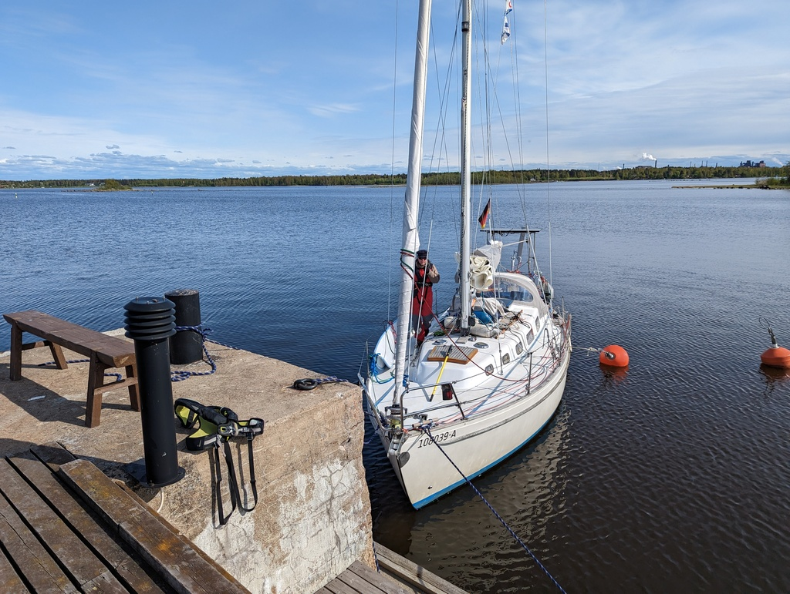

We did some additional provisioning in Hailuoto and got some local beer (thank you Erik & Tina!). The town is nearly 10km away, so transportation was required. Luckily the harbour office had 2 bikes to lend. One of them had no air in the tires so bicycling became a solo mission for Suski. 

 

Departure from Marjaniemi was smooth and the first 20 minutes we spent pounding against the waves with the motor on to get some distance to the shallows. After that it was smooth sailing with wind on the beam. After some time we got a visitor, as an arctic tern landed on the back solar panel. It sat there for nearly an hour before heading out to the sea again. We informed ourselves that the arctic tern spends it's winter as far south as the Antarctica! That is some distance for your migration!

 

We arrived to Iso-Kraaseli expecting to find stern buoys but there were none to be found. The harbour guide spoke about 4 guest places at the end of the pier. Apparently the arrangements have changed and the guest spots are gone for our sized boats. We decided to try and tie up on the smaller boat spots. Very very slowly we proceeded forward, caught the stern buoy that we tied to mid ship and tied our nose to the pier. Just about enough water under the keel for us here, so we'll stay here for the night as near to no wind is expected.

 

The island ferry arrived a bit afterwards and advised us of a big rock in the harbour entrance. Also not in the sea charts or in the guide!

* Distance today: 23.7NM
* Total distance: 1244.2NM
* Engine hours: 0.6
* Lunch: chanterelle risotto
